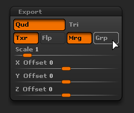

# Correspondência por nome

Correspondência por nome é o nome de um método de filtragem que pode ser usado em Padeiros Substance para isolar malhas de poli baixo e de poli alto com base em seu nome.

Essa funcionalidade é muito útil para evitar o sangramento geométrico um sobre o outro durante o processo de cozimento para obter texturas limpas. Evita-se ter de afastar malhas (muitas vezes referidas como “explodindo”) para alcançar o mesmo resultado.

## Quando Usar Correspondência por Nome

### Assamento de mapa normal com sangramento de malha

Neste exemplo, o capacete na parte superior da cabeça do personagem sangra na face do personagem.

Ao ativar a Correspondência por nome, podemos ignorar o capacete e assar o rosto corretamente. *Este resultado é baseado na configuração principal de Correspondência.*

| *Malha* | *Correspondência Por Nome Desativada* | *Correspondendo Por Nome Em* |
| --- | --- | --- |
| {width="250px"} | {width="250px"} | {width="250px"} |

### Ignorar face de fundo para geometria flutuante

Neste exemplo, os “botões” na parte superior da caixa são geometria flutuante, eles não estão conectados à malha alta de poli. Portanto, eles projetarão sombras por padrão na caixa abaixo deles, que mostrará a borda da geometria.

Ao habilitar a opção Corresponder por nome para a configuração **Ignorar face de fundo**, podemos programar a oclusão do ambiente ignorando a área sob os botões para torná-la como uma caixa singular.*Este resultado é baseado no uso da configuração Ignorar Backface.*

| *Malha* | *Correspondência Por Nome Desativada* | *Correspondendo Por Nome Em* |
| --- | --- | --- |
| {width="250px"} | {width="250px"} | {width="250px"} |

## Como Funciona A Correspondência Por Nome

O sistema Correspondência por nome funciona lendo o nome da geometria nas malhas de poli altas e baixas e usando uma palavra-chave (o sufixo) para identificar/corresponder os nomes. Por padrão, os padeiros usam o sufixo específico, mas podem mudar (veja abaixo).

Os sufixos atuais compatíveis são:

| *Tipo de Sufixo* | *Valor Padrão* | *Uso* |
| --- | --- | --- |
| Poli alto | *\_alto* | Usado para isolar o nome da malha poli alta para coincidir com a poli baixa. |
| Low Poly | *\_low* | Usado para isolar o nome da malha de poli baixo para coincidir com o de poli alto. |
| Ignorar Face Traseira | *\_ignorebf* | Usado para ignorar faces traseiras de padeiros usando raios secundários, como a Oclusão Ambiente.*Esse sufixo deve estar presente apenas nas malhas de alta pressão, por exemplo:**mesh\_high\_ignorebf*** |

Algumas regras a serem consideradas para fazer esse recurso funcionar corretamente:

* A Correspondência por Nome deve ser habilitada em [Parâmetros Comuns](../../bakers-settings/common-parameters/common-parameters.md), pois está **desativada por padrão**.
* Uma configuração secundária Correspondência por Nome pode ser habilitada em alguns padeiros (como [Oclusão ambiente](../../bakers-settings/ambient-occlusion-from/ambient-occlusion-from-mesh.md)) porque eles produzem raios secundários.
* A correspondência diferencia maiúsculas de minúsculas, isso significa que uma malha chamada “**Vela**” não corresponderá a outra chamada “**vela**”.
* Várias malhas podem ser combinadas com base no local em que o sufixo está presente no nome da geometria.

Veja a seguir exemplos de como a correspondência pode funcionar (usando o sufixo padrão):

| Nome do Low Poly | Corresponderá com o Poly alto | Não Corresponderá com Poly Alto |
| --- | --- | --- |
| <ul data-preserve-html="true"><li data-preserve-html="true">body_low</li></ul> | <ul data-preserve-html="true"><li data-preserve-html="true">body_high</li><li data-preserve-html="true">body_high_top</li><li data-preserve-html="true">body_high_1</li><li data-preserve-html="true">body_high_2</li></ul> | <ul data-preserve-html="true"><li data-preserve-html="true">body-high</li><li data-preserve-html="true">body_top_high</li></ul> |
| <ul data-preserve-html="true"><li data-preserve-html="true">Head_low</li></ul> | <ul data-preserve-html="true"><li data-preserve-html="true">Head_high</li></ul> | <ul data-preserve-html="true"><li data-preserve-html="true">head_high</li></ul> |
| <ul data-preserve-html="true"><li data-preserve-html="true">Leg_low_top</li></ul> | <ul data-preserve-html="true"><li data-preserve-html="true">Leg_high</li><li data-preserve-html="true">Leg_high_top</li><li data-preserve-html="true">Leg_high_high_top</li></ul> | <ul data-preserve-html="true"><li data-preserve-html="true">Leg_top_high</li></ul> |

## Como preparar os padeiros

### Ativando Correspondência por Nome

A Correspondência por Nome pode ser habilitada nos [Parâmetros Comuns](../../bakers-settings/common-parameters/common-parameters.md) das configurações de Baker:

| *Software* | *Definindo Configuração* |
| --- | --- |
| **Substance Painter** | <ol class="steps" data-preserve-html="true"> <li class="step" data-preserve-html="true">     Abra a janela de preparo (por meio das Configurações do conjunto de texturas).    </li> <li class="step" data-preserve-html="true">     Exiba os Parâmetros Comuns.    </li> <li class="step" data-preserve-html="true">     Altere a configuração <strong>Corresponder</strong> de “Sempre” para “Por Nome de Malha”.      </li> </ol> |
| **Substance Designer** | <ol class="steps" data-preserve-html="true"> <li class="step" data-preserve-html="true">     Abra a Janela de Preparação (clicando com o botão direito do mouse em uma malha vinculada na Janela do Explorer).    </li> <li class="step" data-preserve-html="true">     Altere a configuração <strong>Corresponder</strong> de “Sempre” para “Por nome de malha”.        </li> </ol> |

### Alterando os nomes de sufixo

Os sufixos padrão são \_low e \_high e podem ser alterados da seguinte maneira:

* **Substance Painter**: na [janela de cozimento](../../getting-started/software-interface/3d-painter/substance-3d-painter.md), dentro dos parâmetros comuns.
* **Substance Designer**: em [Configurações do projeto](https://experienceleague.adobe.com/en/docs/substance-3d-designer/using/workspace/preferences/project-settings), nas configurações de Bicicleta de Torção.

## Malhas de alto polígono do zBrush

Malhas de alto polígono exportadas do zBrush podem ser usadas para cozimento com o recurso Correspondência por nome, no entanto, algumas configurações podem ser seguidas:

| *Formato de arquivo* | *Descrição* |
| --- | --- |
| **FBX** | Nenhum parâmetro específico para ativar/desativar, os arquivos de malha podem ser usados como estão. |
| **OBJ** | Arquivos OBJ exportados pelo zBrush não funcionarão com **Correspondência por nome** por padrão. Em vez disso, é possível dizer ao Substance Painter para usar o nome de arquivo de malha para corresponder malhas por nome.Para fazer isso, verifique se:<ol data-preserve-html="true"><li data-preserve-html="true"><strong>Desabilite</strong> o parâmetro group (Grp) para a subferramenta <strong>each</strong>.</li><li data-preserve-html="true"><strong>Nomeie</strong> o arquivo OBJ adequadamente (ex: <strong>body_high.obj</strong>).</li></ol>  |
