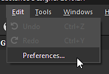
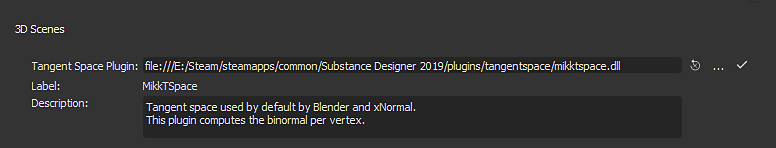

# Espaço Tangente

Os padeiros do Substance podem carregar as Tangentes e os Binormais presentes na malha de baixo polímero ou recalculá-los. Ao recomputá-los é possível definir um algoritmo personalizado de Tangent Space (por padrão é MikkTSpace).

## Lista de plug-ins do espaço Tangent

## Substance Painter

No Substance Painter, o plug-in Tangent Space não pode ser alterado; será sempre **MikkTSpace**. No entanto, há um parâmetro para alterar ligeiramente seu comportamento para torná-lo compatível com outros aplicativos:

| *Parâmetro* | *Compatível* *Aplicativo* |
| --- | --- |
| **Calcular espaço tangente por fragmento: desabilitado** | Compatível com xNormal, Unity 5.3 ou mais recente. |
| **Calcular espaço tangente por fragmento: Habilitado** | Compatível com Unreal Engine 4, Blender e Unity HDRP workflow. |

## Substance Designer

O Substance Designer suporta o seguinte algoritmo:

| *Nome do arquivo* | *Descrição* |
| --- | --- |
| **mikktspace.dll** | MikkTSpace, algoritmo de Tangent Space baseado no trabalho de Morten S. Mikkelsen.Compatível com xNormal, Unity 5.3 ou mais recente. |
| **mikkunrealtspace.dll** | MikkTSpace, algoritmo de Tangent Space baseado no trabalho de Morten S. Mikkelsen.Compatível com Unreal Engine 4, Blender e Unity HDRP workflow. |
| **unitytspace.dll** | Algoritmo do Tangent Space baseado no Unity 4. |

>[!NOTE]
>
> É possível escrever um plug-in personalizado Tangent Space. Um arquivo de cabeçalho chamado **tangentspaceplugin.h** está disponível na pasta de instalação em **Substance Designer/SDK/tangentspace** e pode ser usado como uma interface.

## Definir um espaço tangente personalizado

## Substance Painter

O Substance Painter não é compatível com plug-ins personalizados do Tangent Space no momento. Isso significa que se Tangents e Binormals não estiverem presentes na malha de baixo-poli (usada para criar o projeto) eles serão recalculados com base no algoritmo MikkTSpace.

## Substance Designer

Para definir o algoritmo de espaço tangente em Substance Designer, siga estas etapas:

1. Escolha **Editar** > **Preferências**.

   
1. Clique em **Projetos**.

   
1. Navegue até a guia **Geral**. Role até que a seção **Cenas 3D** esteja visível.

   
1. Clique nos **três pontos** (...) para carregar um plugin personalizado.

## Substance Automation Toolkit

Ao assar com o Kit de ferramentas de automação, é possível especificar o plug-in Espaço tangente com um argumento de linha de comando específico:

```
sbsbaker normal-from-mesh --tangent-space-plugin "C:/Substance Designer/plugins⁄tangentspace⁄mikktspace.dll" ...
```
