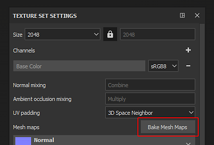

# Substance 3D Painter

A janela de cozimento pode ser acessada por meio das [Configurações do conjunto de textura](https://experienceleague.adobe.com/en/docs/substance-3d-painter/using/interface/texture-set/texture-set-settings). Clique no botão chamado “**Fazer mapas de malha**” para abrir a janela de cozimento do projeto atual.

## Visão geral

{width="400px"}

A janela de cozedura é dividida em três componentes principais.

### Lista Baker

No canto superior esquerdo da janela estão disponíveis vários botões.

Ao lado desse botão há uma caixa de seleção, se estiver marcada, ela habilitará esse processo de cozimento para o processo de cozimento. Os botões que têm um ícone ao lado de seus nomes indicam aqueles que precisam de uma malha de alta poli. Esse ícone exibe um aviso se agora houver alto índice disponível.

| *Botão* | *Descrição* |
| --- | --- |
| **Comum** | Altere a exibição de parâmetros para [Parâmetros comuns](../../../bakers-settings/common-parameters/common-parameters.md). |
| **Normal** | Altere a exibição de parâmetros para [Parâmetros normais](../../../bakers-settings/normal-map-from-mesh/normal-map-from-mesh.md). |
| **Espaço Mundial Normal** | Altere a exibição de parâmetros para os [parâmetros Normais do Espaço Mundial](../../../bakers-settings/world-space-normals/world-space-normals.md). |
| **ID** | Altere a exibição de parâmetros para [Parâmetros de cores](../../../bakers-settings/color-map-from-mesh/color-map-from-mesh.md). |
| **Oclusão de ambiente** | Altere a exibição de parâmetros para [Parâmetros de Oclusão de ambiente](../../../bakers-settings/ambient-occlusion-from/ambient-occlusion-from-mesh.md). |
| **Curvatura** | Altere a exibição de parâmetros para [Parâmetros de curvatura](../../../bakers-settings/curvature/curvature.md). |
| **Posição** | Altere a exibição de parâmetros para [Parâmetros de posição](../../../bakers-settings/position/position.md). |
| **Thickness** | Altere a exibição de parâmetros para [parâmetros de Thickness](../../../bakers-settings/thickness-map-from-mesh/thickness-map-from-mesh.md). |
| **Height** | Altere a exibição de parâmetros para [parâmetros de Height](../../../bakers-settings/height-map-from-mesh/height-map-from-mesh.md). |
| **Normais tortos** | Altere a exibição de parâmetros para os [parâmetros normais entortados](../../../bakers-settings/bent-normals-from-mesh/bent-normals-from-mesh.md). |
| **Opacidade** | Altere a exibição de parâmetros para [Parâmetros de opacidade](../../../bakers-settings/opacity-mask-from-mesh/opacity-mask-from-mesh.md). |

### Parâmetros

Esta parte da janela exibe as várias configurações de cozimento. Seu conteúdo pode mudar dependendo do padeiro atualmente selecionado ou dos parâmetros comuns.

Para saber mais sobre as configurações do padeiro, consulte as [Configurações do Padeiro](../../../bakers-settings/bakers-settings.md).

### Mensagem de ajuda

{width="500px"}

Esta parte da janela mostra as várias dicas de ferramentas e mensagens de ajuda relacionadas às configurações. Mova o mouse sobre uma configuração para ler sua dica de ferramenta.
