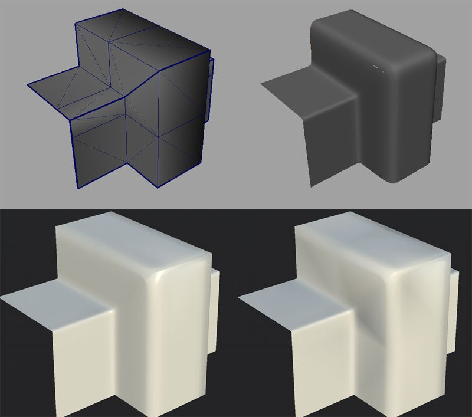

# Triangulação antes da cozedura

Malhas 3D podem ser definidas com polígonos com várias bordas de borda por face. Normalmente via quads (4 bordas), às vezes mais (n-gonos).\
Entretanto, o software transforma esses polígonos em triângulos mais tarde, porque é mais fácil gerenciar e executar a computação (especialmente na GPU).

## Como a triangulação pode afetar uma malha?

Não há **soluções padrão** para converter Quad/N-Gons em triângulos. Conforme demonstrado na imagem acima, várias opções são válidas.\
É improvável que os padeiros triangulem malhas como um motor de jogo faria porque escolhemos um algoritmo específico em vez de outro.

## Por que triangular antes de assar?

O processo de cozimento lerá a geometria e, em seguida, codifica as informações em texturas.\
Como essas informações são baseadas em UVs e às vezes na topologia de malha, outros softwares podem decodificar as informações incorretamente se eles não leem a geometria da mesma maneira que quando aplicam a textura.

Na imagem abaixo, você pode ver a malha de baixo polígono na parte superior esquerda e a malha de alto polígono na parte superior direita.\
Na parte inferior está o baixo-poli com o mapa normal assado do alto-poli. A malha à esquerda usa uma triangulação idêntica à usada pela Substance Painter ao assar. A malha à direita não exibe e exibe artefatos pretos. Isso ocorre porque há uma incompatibilidade entre como o mapa normal foi preparado e como a malha está triangulada no momento. Isso pode ser corrigido **atualizando a malha e/ou recozinhando**.

