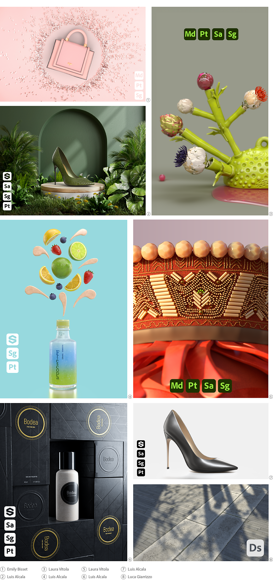

# Ícones do Substance 3D para artistas

<table>
  <tr style="border: 0;">
    <td style="border: 0;" valign="top"></td>
    <td style="border: 0;" valign="top"></td>
    <td style="border: 0;" valign="top"></td>
    <td style="border: 0;" valign="top"></td>
    <td style="border: 0;" valign="top"></td>
    <td style="border: 0;" valign="top"></td>
    <td style="border: 0;" valign="top"></td>
  </tr>
</table>

Artistas que desejam incluir ícones de aplicativos da Substance 3D em suas ilustrações publicadas podem baixá-los abaixo. As imagens usam o formato SVG, portanto, podem ser usadas em qualquer escala.

[Baixe uma pasta zip contendo versões coloridas, em preto e branco dos ícones do aplicativo Substance 3D.](../../assets/substance3d-icons.zip)

## Biblioteca Creative Cloud

Os usuários do Creative Cloud podem acessar esses ícones em aplicativos Creative Cloud por meio desta biblioteca compartilhada:

[Ícones do Substance 3D](https://www.adobe.com/files/libraries/urn:aaid:sc:EU:0e944904-0efe-427f-8547-92744a19eeaf)

## Exemplos

