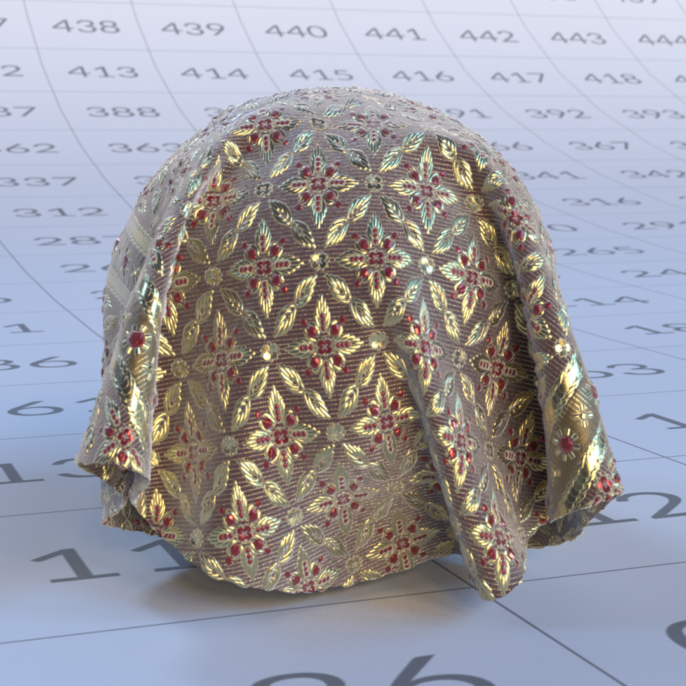

# OpenPBR

[**Baixe uma versão offline desta página.**](../assets/openpbrf/openpbr.pdf)

O **OpenPBR** é um modelo de sombreamento de superfície aberto e baseado fisicamente criado para fornecer uma maneira consistente e previsível de descrever materiais em diferentes ferramentas 3D, renderizadores e pipelines. Ele define um único modelo de material abrangente capaz de representar uma ampla variedade de superfícies reais, permanecendo flexível o suficiente para suportar visuais mais estilizados ou artísticos usando parâmetros fisicamente significativos.

O modelo aborda inconsistências de longa data entre sombreadores “padrão” que se comportam de maneira semelhante no nome, mas diferem nas definições de parâmetros e pressupostos físicos entre os aplicativos. Fundamentado nos princípios da renderização baseada fisicamente, OpenPBR descreve os materiais em termos de comportamento de luz do mundo real, enfatizando a conservação de energia, faixas de parâmetros intuitivos e respostas estáveis de iluminação. Em vez de prescrever uma interface de usuário específica, o OpenPBR define como os materiais se comportam em um nível fundamental, permitindo que as ferramentas implementem o modelo de sua própria maneira, preservando resultados visuais consistentes à medida que os ativos se movem entre aplicativos e pipelines.

Este documento é um guia focado no artista para entender e trabalhar com OpenPBR. Ele explica os princípios subjacentes do modelo, como seus componentes descrevem o comportamento da luz no mundo real e como essas ideias se traduzem em criação material prática. Em vez de se concentrar em um aplicativo específico, o guia destina-se a artistas 3D que trabalham em áreas que incluem desenvolvimento de aparência, texturização e renderização que desejam criar materiais robustos e fisicamente plausíveis que permaneçam consistentes e transferíveis entre diferentes ambientes de software.

>[!NOTE]
>
> Se você já estiver trabalhando com OpenPBR e estiver procurando assistência técnica, as [Perguntas frequentes sobre OpenPBR](openpbr-faq.md) talvez já tenham respostas para suas perguntas.

*A cena de demonstração de OpenPBR acima foi criada por Nikie Monteleone. O material de exemplo e as renderizações de canal neste documento foram criados por Celine Dameron.*

## Interoperabilidade e padrões de arquivos

### Um idioma material compartilhado com o OpenPBR

Um dos principais objetivos do OpenPBR é melhorar a movimentação de materiais entre ferramentas. Em vez de ser um sombreador vinculado a um único renderizador ou aplicativo, o OpenPBR define um **modelo de sombreamento compartilhado** - uma maneira comum de descrever como um material responde à luz.

Para os artistas, isso significa que um material de OpenPBR não é apenas, por exemplo, “um material de Adobe” ou “um material da Autodesk”, mas sim uma descrição do comportamento de superfície e volume que pode, em princípio, ser entendido por várias ferramentas. A intenção é que um material criado em um aplicativo possa ser interpretado consistentemente em outro lugar, desde que essas ferramentas suportem o modelo de OpenPBR.

### O problema de intercâmbio de ativos

A especificação do OpenPBR reconhece explicitamente um desafio de longa data na produção: **os materiais não viajam bem entre os aplicativos**. Renderizadores diferentes geralmente usam diferentes nomes de parâmetro, suposições de sombreamento e modelos subjacentes, o que torna a correspondência de aparência difícil e demorada.

O OpenPBR é concebido como uma resposta a este problema. Ao definir um único modelo de material fisicamente aterrado que cobre as necessidades comuns de produção - metais, dielétricos, materiais em camadas, transmissão, dispersão - fornece um alvo estável para intercâmbio. Embora isso não garanta correspondências visuais perfeitas em todas as situações, reduz significativamente a ambiguidade em comparação com modelos de shader proprietários.

Para os artistas, o argumento prático é que o OpenPBR visa preservar a *intenção*. Mesmo quando a paridade visual exata não é possível, a estrutura do material - o que é metal, o que é transmissivo, quão áspera ou anisotrópica uma superfície é - permanece clara e transferível.

### Relação com o MaterialX

O OpenPBR está intimamente ligado ao **MaterialX**, uma estrutura padrão do setor para descrever materiais e aparências de uma forma agnóstica em relação ao renderizador. A implementação de referência do OpenPBR está dentro do MaterialX, o que significa que os materiais de OpenPBR podem ser representados usando um formato de intercâmbio estabelecido já suportado em muitos pipelines.

Esta relação é importante porque o próprio OpenPBR **não é um formato de arquivo**. Em vez disso, ele define *o que* é um material, enquanto o MaterialX fornece um modo padronizado de *armazenar e trocar* esse material entre ferramentas. Na prática, isso permite que os materiais de OpenPBR sejam incorporados em descrições de cena mais amplas e compartilhados entre DCCs e renderizadores que suportam MaterialX.

Para os artistas, isso geralmente acontece debaixo do capô - mas explica por que os materiais de OpenPBR são cada vez mais descritos como “portáteis” ou “interoperáveis” em dutos modernos.

### O que interoperabilidade significa, e não significa

É importante definir expectativas realistas em relação à interoperabilidade. O OpenPBR não promete que um material parecerá idêntico em todas as aplicações. As diferenças na iluminação, nos algoritmos de renderização, no gerenciamento de cores e no suporte a recursos ainda podem afetar a imagem final.

O que o OpenPBR oferece é uma linha de base comum: um conjunto consistente de parâmetros e comportamentos, um entendimento compartilhado de como os materiais são construídos e um caminho mais claro para a transferência de materiais entre ferramentas sem reconstruí-los do zero.

Para os artistas, isso significa menos surpresas quando os ativos são movidos entre departamentos ou aplicativos, e um fluxo de trabalho que enfatiza a lógica de material durável em vez de truques específicos de ferramentas.

### Implicações práticas para os artistas

Do ponto de vista do dia a dia, trabalhar com hábitos de OpenPBR incentiva que naturalmente apoiem a interoperabilidade:

* Pensando em termos de comportamento da luz, em vez de tipos de materiais específicos da aplicação
* Utilização de parâmetros com significado físico (metalidade, rugosidade, transmissão, dispersão)
* Evitar a dependência de soluções não documentadas ou específicas do renderizador

Mesmo quando os materiais nunca saem de um aplicativo único, essas práticas se alinham aos padrões modernos de pipeline — tornando os ativos mais à prova de obsolescência à medida que as ferramentas e os renderizadores evoluem.

## Tipos de material

### Materiais definidos por interação com a luz

O OpenPBR é um modelo monolítico (um “subsombreador”) destinado a representar uma ampla gama de tipos de materiais; tais tipos são descritos em termos de como a luz interage com eles. Em vez de definir materiais em termos de predefinições fixas, como, por exemplo, “vidro” ou “pele”, cada material de OpenPBR é construído a partir de um modelo de camadas horizontais e verticais, o que permite aos artistas misturar características totalmente definidas e fisicamente significativas - tais como reflexão difusa, reflexão de specular, transmissão, dispersão subsuperficial, e camadas. Diferentes combinações desses comportamentos produzem naturalmente materiais familiares do mundo real.

<table>
  <tr style="border: 0;">
    <td style="border: 0;" valign="top"></td>
    <td style="border: 0;" valign="top"></td>
    <td style="border: 0;" valign="top"></td>
  </tr>
</table>

Esta abordagem usa um modelo fixo que define com antecedência a estrutura de camadas e mixagem, assim contornando qualquer exigência para o artista criar uma rede de sombreamentos em uma base caso a caso, e permite que o OpenPBR represente materiais simples e complexos de uma forma consistente e fisicamente aterrada.

 Clique para aplicar zoom. *Figura adaptada da especificação de Superfície de OpenPBR, © Academy Software Foundation, usada sob a Licença Apache 2.0*

### Comportamentos do material principal

Embora o OpenPBR não imponha tipos de materiais rígidos, a maioria dos materiais do mundo real se enquadra em algumas categorias comportamentais. Compreender essas categorias pode ajudar a estabelecer um modelo mental sólido para materiais de construção.

### Materiais dielétricos (não metálicos)

<table>
  <tr style="border: 0;">
    <td style="border: 0;" valign="top"> <em>Exemplo de um material dielétrico.</em></td>
    <td style="border: 0;" valign="top">Os dielétricos são materiais não metálicos, como plástico, madeira, pedra, tecido, borracha e pele. Suas características definidoras são:  <ul><li>Um componente difuso visível</li><li>Reflexos de specular na sua maioria incolores (brancos)</li><li>Refletividade controlada principalmente pelo Índice de Refração (IOR)</li><li>Nenhum comportamento de reflexo metálico</li></ul>  <strong>Parâmetros de chave para materiais dielétricos:</strong>  <ul><li>A cor base define a cor geral do material</li><li>A cor do specular influencia o tom dos destaques do specular (mais proeminente nos ângulos de pastagem)</li><li>A Aspereza do specular controla o aspecto nítido ou desfocado dos realces do specular</li><li>Peso do specular dimensiona a intensidade geral dos destaques do specular </li><li>Para materiais dielétricos, a reflexão difusa domina a aparência da superfície e é controlada pela Cor base. As reflexões do specular são limitadas na incidência normal e aumentam em direção aos ângulos de pastagem, mas permanecem sem tonalidade.</li></ul></td>
  </tr>
</table>

### Materiais metálicos

<table>
  <tr style="border: 0;">
    <td style="border: 0;" valign="top"> <em>Um exemplo de um material metálico.</em></td>
    <td style="border: 0;" valign="top">Materiais metálicos como aço, alumínio, cobre ou ouro se comportam fundamentalmente de forma diferente dos materiais não metálicos (dielétricos). Para os metais, a aparência é impulsionada quase inteiramente pela reflexão do specular: ao contrário dos dielétricos, os metais não têm componentes difusos, e a luz não dispersão sob a superfície, mas é refletida diretamente. Suas características definidoras são:  <ul><li>Nenhum componente difuso — a cor vem inteiramente do reflexo</li><li>Reflexos de specular coloridos</li><li>Os detalhes da superfície, especialmente a aspereza, desempenham um papel importante na aparência</li></ul>  <strong>Parâmetros chave para materiais metálicos:</strong>  <ul><li>Cor de base controla a cor dos reflexos</li><li>A Aspereza do specular controla o nível de nitidez ou desfoque dos reflexos</li><li>Intensidade de reflexo das escalas de Peso do specular</li></ul></td>
  </tr>
</table>

### Espessura da base metálica

A Metalidade de base define se um material se comporta como um dielétrico ou um metal — isso não é apenas um ajuste visual, mas uma alteração na resposta da luz subjacente do material.

* **0** → totalmente não-metálico (difuso + specular)
* **1** → totalmente metálico (somente specular)
* **0-1** → uma mistura de ambos os comportamentos. Os valores intermediários são mais adequados para misturas de materiais como dirt, corrosão ou superfícies gastas, em vez de materiais “parcialmente metálicos”.

#### Diretrizes práticas para a metalurgia

* Usar **0** ou **1** para a maioria dos materiais
* Usar valores médios somente para superfícies misturadas
* Confie na aspereza e nos detalhes da superfície para moldar a aparência metálica.

Use camadas (por exemplo, Revestimento) em vez de reduzir a metalidade para metais pintados ou revestidos, transparentes e Materiais de transmissivo.

### Materiais transparentes e de transmissivo

Materiais transparentes e de transmissivo permitem que a luz passe por eles. Exemplos comuns incluem vidro, muitos líquidos e plásticos claros ou coloridos. Suas características definidoras são:

* A luz entra na superfície e sai pelo lado oposto
* O thickness afeta fortemente a aparência
* Refração controlada pelo Índice de Refração (IOR) e afetada pela aspereza da superfície
* Refração, absorção, dispersão e forma a aparência final

A transmissão descreve como a luz viaja através de um objeto. As áreas mais espessas parecem mais escuras ou mais saturadas, enquanto as áreas mais finas parecem mais claras. Parâmetros como Cor de transmissão, Profundidade de transmissão, Cor de Dispersão e Dispersão funcionam juntos para controlar esse comportamento.

Um ponto de distinção entre os termos &#39;transparente&#39; e &#39;transmissivo&#39;: &#39;transparente&#39; é um termo cotidiano da vida real; algo é transparente se pudermos ver através dele. “Transmissivo” é um sinônimo de “translucidez”. O vidro fosco, por exemplo, permite que a luz passe por ele (e assim, é transmissivo), mas não é transparente - não podemos enxergar através dele.

### Materiais do subsolo

<table>
  <tr style="border: 0;">
    <td style="border: 0;" valign="top"> <em>Um exemplo de um material que usa dispersão superficial.</em></td>
    <td style="border: 0;" valign="top">Os materiais da subsuperfície permitem que a luz entre na superfície, dispersão abaixo dela e saia novamente perto do ponto de entrada. Exemplos comuns incluem pele, cera, mármore e muitos materiais orgânicos, como muitos tipos de alimentos. - frutas, legumes ou queijos Saint-Nectaire, por exemplo. As características definidoras dos materiais de subsuperfície são:   <ul><li>Sombreamento suave e difuso</li><li>Sangramento de cor em áreas finas</li><li>A aparência depende do thickness</li><li>A luz não passa através do objeto</li></ul>   Dispersão subsuperficial é diferente de transmissão. Enquanto a transmissão descreve a luz que passa por um material e sai do lado oposto, a dispersão da subsuperfície descreve a luz que entra em uma superfície, dispersa dentro dessa superfície e, em seguida, sai na vizinhança do ponto pelo qual entrou, principalmente no mesmo lado. Particularmente, materiais metálicos não suportam transmissão ou dispersão subsuperficial. Alterar o valor de transmissão ou subsuperfície de um material completamente metálico (ou seja, um material cujo valor de Metalidade de base é 1) não afetará sua aparência.</td>
  </tr>
</table>

## Mesclagem Entre Comportamentos De Material

Materiais do mundo real raramente são perfeitamente puros. Muitas superfícies são melhor descritas como misturas de comportamentos, em vez de pertencerem a uma única categoria. Por exemplo, se uma superfície apresentar sinais de dirt, desgaste ou ferrugem, diferentes partes da superfície reagirão à luz de maneiras diferentes. O OpenPBR suporta isso, permitindo que a mistura se misture suavemente, de uma parte de uma superfície para outra.

### Metalidade como um Combinar

<table>
  <tr style="border: 0;">
    <td style="border: 0;" valign="top"> <em>Nesse material, o ferro tem uma metalidade de 1, enquanto a ferrugem tem uma metalidade de 0. Pode haver valores intermediários de metalidade onde a ferrugem faz a transição para ferro.</em></td>
    <td style="border: 0;" valign="top">Embora a metalidade seja normalmente definida como 0 ou 1 (ou seja, totalmente não metálica ou totalmente metálica), os valores intermediários são significativos. Esses valores representam superfícies em que materiais metálicos e não metálicos são misturados em pequena escala, em casos como tintas contendo partículas ou flocos de metal. Além disso, como mencionado anteriormente, os materiais de OpenPBR são construídos a partir de camadas que representam interfaces físicas distintas. É inteiramente possível que a camada de base de um material (é a camada de “núcleo”) seja metálica, mas para ela ter uma camada de revestimento não metálico acima - a camada de revestimento não é simplesmente um controle de specular adicional - ela representa uma superfície física separada através da qual a luz deve passar. Isso seria o caso de alguns tipos de tinta de carro, por exemplo: flocos metálicos seriam representados na camada de base do material, enquanto a camada de revestimento representaria uma laca de revestimento claro.</td>
  </tr>
</table>

### Combinar camadas para criar um comportamento complexo

Materiais complexos, como o vidro fosco ou a tinta do carro mencionada anteriormente nesta seção, são criados combinando vários comportamentos de forma controlada. Por exemplo:

* **Vidro fosco**: transmissão combinada com alta aspereza e dispersão
* **Metal pintado**: uma superfície dielétrica sobre uma base metálica, geralmente com uma pelagem transparente. Em vez de pensar em termos de predefinições, é mais eficaz considerar quais comportamentos físicos estão presentes e como eles interagem. Os materiais de OpenPBR são definidos por componentes fisicamente significativos que descrevem como a luz interage com as superfícies. Os “tipos” de materiais surgem naturalmente de combinações de comportamentos, em vez de serem selecionados explicitamente. Ao se concentrar na interação com a luz, na mesclagem e na disposição em camadas, os artistas podem criar uma ampla variedade de materiais realistas, mantendo a plausibilidade física.

## Trabalhando com OpenPBR

### A Arquitetura Conceitual de um Material de OpenPBR

O OpenPBR foi projetado como um modelo de sombreamento de superfície único e unificado capaz de representar uma ampla variedade de materiais do mundo real. Em vez de alternar entre diferentes sombreadores para diferentes tipos de materiais, o OpenPBR combina várias características de superfície em uma arquitetura em camadas.

Conceitualmente, você pode pensar em um material de OpenPBR como possuindo três elementos-chave:

* **Uma estrutura fundamental**: o OpenPBR considera que um material é feito de blocos de construção físicos que podem ser mesclados (mistura horizontal) ou empilhados uns sobre os outros (camada vertical). Esses blocos podem reagir à luz de maneira diferente. Quando dois desses blocos forem mesclados, o resultado será uma mesclagem do reflexo dos dois. No entanto, quando estão em camadas, o bloco mais baixo só recebe e reflete a quantidade de luz que o bloco mais acima deixa passar. Essa configuração permite que os artistas considerem o material como uma mistura de componentes mais simples. A definição desses componentes e a localização dos mesmos constituem o segundo elemento-chave:
* **Uma série de camadas que contribuem para a estrutura compartilhada**: cada material terá uma camada Base, que determina características como a cor principal do material ou se o material é áspero ou suave. Os materiais também podem ter camadas adicionais - Película fina, Revestimento e Fuzz - que podem reproduzir efeitos como verniz ou dust.
* **Um conjunto de controles voltados para o artista**: uma interface que permite a um artista controlar as regras da estrutura de reflexão - e assim, a aparência geral do material de OpenPBR. Dependendo de como um software específico possa representar esses controles em sua interface de usuário, eles são essencialmente um conjunto de botões ou controles deslizantes que permitem que um artista controle, por exemplo, quão fortes devem ser os reflexos ou qual tonalidade de cor deve aparecer em determinados ângulos de visualização. Alguns controles serão aplicados à estrutura geral (e, portanto, serão aplicados a todas as camadas do material); alguns controles serão aplicados apenas a camadas específicas.

### Camadas de material na estrutura

 Clique para aplicar zoom. *Figura adaptada da especificação de Superfície de OpenPBR, © Academy Software Foundation, usada sob a Licença Apache 2.0*

Cada camada contribui com um efeito físico específico, e o modelo de material gerencia como essas camadas interagem de uma maneira fisicamente plausível. Essa estrutura em camadas é consistente nas implementações de OpenPBR. Aplicativos individuais permanecem livres para apresentar uma interface de usuário que controla essas camadas como acharem melhor.

>[!NOTE]
>
> Há duas “camadas” que não aparecem no diagrama acima:
>
> * **Specular**: controla o quão brilhante ou reflexiva é uma superfície, se a base é metálica ou não. O specular existe dentro da pilha de camadas, mas não é em si uma camada real, é uma propriedade das camadas de base e revestimento que aparecem na pilha de camadas.
> * **Geometria**: enquanto outras camadas de OpenPBR determinam do que o material é feito, a camada Geometria define a forma e a presença na qual o material é aplicado, incluindo opacidade, normais, tangentes e comportamento de parede fina.
>
> Continuaremos nos referindo à geometria e ao Specular como “camadas” para simplificar.

As camadas que constituem uma superfície de OpenPBR, do mais profundo ao mais exterior, são:

* **A Camada Base**: na parte inferior de um material de OpenPBR, a camada Base define a interação fundamental entre a luz e o material. Os parâmetros dessa camada de base determinam a cor principal do material, se é áspero ou liso, e se (em termos de como interage com a luz) é metálico ou não metálico (também conhecido como dielétrico).

>[!NOTE]
>
> Para a maioria dos materiais a camada base é absolutamente necessária. As camadas acima disso (filme fino, revestimento e Fuzz) podem ou não estar presentes, dependendo do tipo de material que está sendo reproduzido em 3D.

* **Filme fino**: se presente, uma camada de filme fino é posicionada acima da camada base. Reproduz a aparência visual de camadas superficiais muito finas, produzindo cores iridescentes, como as vistas em bolhas de sabão, metal queimado ou filmes de óleo.

* **Revestimento**: uma camada de Revestimento, se presente, reproduz uma camada transparente e reflexiva posicionada acima de todas as outras camadas, exceto Fuzz. Isso pode simular efeitos do mundo real, como verniz, superfícies molhadas ou certos tipos de pintura de carro.

* **Fuzz**: se presente, uma camada de Fuzz reproduz o reflexo das microfibras. Pode ser usado para reproduzir a aparência de um tecido difuso, por exemplo, ou uma camada de dust.

A maneira como cada uma dessas camadas interage com a luz é determinada por um conjunto de parâmetros.

### Tipos de materiais

A Metalidade Base, por sua vez, determina as características que se aplicam à próxima camada do material - um material inteiramente não-metálico possui características diferentes de um material metálico.

#### Materiais não metálicos (Metalidade de base = 0)

Um material totalmente não metálico (ou seja, um material com um valor de Metalidade de base 0) será dividido em três tipos básicos: **difuso**, **subsuperfície** ou **translúcido**. Observe que os materiais não necessariamente se enquadram em apenas um dos tipos de base acima. Materiais mais complexos que são uma mistura desses tipos de materiais básicos são possíveis.

**Materiais difusos** são geralmente materiais opacos, como madeira ou pedra.

**Materiais de subsuperfície** dispersões a luz internamente; a pele ou a cera seriam abrangidas por esse tipo de material, por exemplo.

**materiais de base translúcidos** permitem que a luz passe através deles; eles incluem materiais como vidro, cristal ou certos líquidos. Os principais parâmetros a serem considerados são os parâmetros globais de specular, os parâmetros da camada Base e os parâmetros específicos de Transmissão, abaixo. A diferença entre dispersão subsuperficial (SSS) e transmissão é essencialmente que o SSS não permite que você veja através do material - um feixe de luz é espalhado dentro de um material e, em seguida, volta para o mesmo lado. A transmissão, inversamente, rege materiais que são pelo menos parcialmente transparentes - um feixe de luz passa pelo material.

#### Materiais metálicos (metalidade > 0)

Por outro lado, quando o Metalidade de base está ativado (ou seja, tem um valor maior que 0), ele adquire algumas características comportamentais específicas:

* O valor da Cor de Specular do material controla a tonalidade do material perto dos ângulos de pastagem (quando a luz atinge uma superfície em um ângulo próximo ao paralelo).
* O valor da Cor base do material controla o reflexo na incidência normal (ou seja, quando a luz é refletida a 90 graus da superfície).
* O valor do Peso do Specular do material dimensiona a intensidade geral das reflexões, afetando os ângulos normal e de pastagem.

Combinados com os seguintes canais, materiais metálicos podem criar vários efeitos.

**Emissão**

A emissão permite que uma superfície aja como fonte de luz ao emitir luz diretamente. Embora a emissão não seja um fenômeno reflexivo, ela é incluída no modelo de material de OpenPBR para que os materiais de emissivo possam ser definidos consistentemente ao lado de propriedades reflexivas e de transmissivo.

**Filme fino**

<table>
  <tr style="border: 0;">
    <td style="border: 0;" valign="top"></td>
    <td style="border: 0;" valign="top">Um efeito de película fina, se presente, reproduz a aparência visual de camadas superficiais muito finas, produzindo cores iridescentes, como as vistas em bolhas de sabão, ou filmes de óleo.</td>
  </tr>
</table>

**Revestimento**

Uma camada de revestimento, se presente, reproduz uma camada transparente e reflexiva posicionada acima de todas as outras camadas, exceto Fuzz. Isso pode simular efeitos do mundo real, como verniz, ou certos tipos de tinta do carro. Uma camada de Revestimento é definida por um intervalo entre 0 e 1. Definir esse valor como 0 desativa completamente a camada de Revestimento.

**Fuzz**

Uma camada Fuzz (Fuzz) pode ser adicionada para reproduzir a aparência de superfícies semelhantes a tecidos, como veludo ou cetim, ou pode ser usada para criar o efeito de uma camada de dust em uma superfície.

### Conceitos de fluxo de trabalho de material

#### Pensando em Comportamentos Leves, Não em Rótulos Materiais

O OpenPBR é projetado em torno de como a luz se comporta, em vez de em torno de categorias de materiais fixos. Em vez de selecionar um sombreador que representa “vidro”, “pele” ou “metal”, os artistas constroem materiais descrevendo como a luz reflete a partir de uma superfície, passa por ela, dispersão dentro dela ou é emitida por ela. Esta abordagem incentiva uma mudança de mentalidade: os materiais não são tipos predefinidos, mas combinações de comportamentos físicos. Um único material do mundo real pode envolver vários desses comportamentos de uma só vez, e o OpenPBR torna essas contribuições explícitas em vez de ocultá-las atrás de predefinições ou modelos de sombreamento opacos.

#### Separação de preocupações: os materiais são independentes da iluminação

Um princípio central dos fluxos de trabalho fisicamente baseados é a separação entre a descrição do material e a iluminação. Os materiais são criados para descrever propriedades intrínsecas de superfície e volume, enquanto a iluminação define o ambiente no qual essas propriedades são reveladas. Essa separação reduz a interdependência e torna as cenas complexas mais gerenciáveis. Um material de OpenPBR bem-criado deve permanecer acreditável em uma ampla variedade de condições de iluminação, sem exigir ajustes específicos da cena. Em uma escala menor, o OpenPBR continua essa filosofia, mantendo os parâmetros o mais independentes possível, permitindo que os artistas ajustem um aspecto de um material sem desestabilizar os outros sem querer.

#### Materiais de construção incrementalmente

O OpenPBR incentiva uma abordagem incremental para a criação de materiais. A maioria dos workflows começa estabelecendo a resposta da superfície - como a luz reflete a partir do objeto - antes de introduzir efeitos de volume, como transmissão ou dispersão subsuperficial. Comportamentos secundários, incluindo interferência de difusão, emissão ou filme fino, geralmente são dispostos em camadas posteriormente para refinar o realismo ou obter dicas visuais específicas. Essa abordagem em camadas ajuda os artistas a diagnosticar problemas mais facilmente e evitar complicar demais os materiais no início do processo. Desenvolvendo de comportamentos primários a secundários, os materiais permanecem mais fáceis de compreender, depurar e reutilizar.

#### Predefinições e exemplos como ferramentas de aprendizado

OpenPBR inclui predefinições para materiais comuns, mas elas são mais bem entendidas como exemplos de referência do que soluções finais. Examinar como as predefinições equilibram parâmetros como aspereza, metalidade ou profundidade de transmissão pode ajudar os artistas a entender como resultados visuais específicos são construídos. Em vez de depender das predefinições em atacado, os fluxos de trabalho de OpenPBR incentivam os artistas a observar materiais do mundo real, identificar os comportamentos de luz subjacentes em jogo e recriar esses comportamentos usando controles fisicamente significativos.

## Canais e parâmetros do OpenPBR

### Especular

{width="250"}

*Um material cinzento dielétrico (não metálico) com cor de specular amarela.*

+++parâmetros de specular

**Peso do Specular**

Enquanto a Cor do Specular determina a tonalidade de cor de qualquer reflexo em ângulos de pastagem, o Peso do Specular determina a intensidade desses reflexos, entre um intervalo de 0 a 1. Com um valor de 0, não há nenhum reflexo em ângulos de pastagem; com valores mais altos, a intensidade de tais reflexões se torna mais pronunciada. Observe que, no “mundo real”, todo material é reflexivo em algum grau e, se recriado em 3D, teria um valor de Peso do Specular maior que 0. Observe também que o Peso do Specular não deve ser considerado de forma alguma como um valor “principal” para parametrizar o reflexo de um material; a Aspereza do Specular (veja abaixo) é sempre uma consideração-chave na determinação da refletividade de um material.

<table>
  <tr style="border: 0;">
    <td style="border: 0;" valign="top"> <em>Specular = 0,0</em></td>
    <td style="border: 0;" valign="top"> <em>Specular = 0,5</em></td>
    <td style="border: 0;" valign="top"> <em>Specular = 1,0</em></td>
  </tr>
</table>

**Cor do Specular**

Isso determina qualquer tonalidade de cor a reflexos quando a luz reflete em um ângulo de pastagem (um ângulo quase paralelo à superfície de um material). Para materiais metálicos (veja Metalidade abaixo), uma tonalidade de cor pode ser aplicável. Para materiais não metálicos, a Cor do Specular normalmente deve ser branca. As imagens abaixo mostram diferentes cores de specular em materiais metálicos e não metálicos.

<table>
  <tr style="border: 0;">
    <td style="border: 0;" valign="top"> </td>
    <td style="border: 0;" valign="top"> </td>
    <td style="border: 0;" valign="top"> </td>
  </tr>
  <tr style="border: 0;">
    <td style="border: 0;" valign="top"> <em>Cor de Specular verde</em></td>
    <td style="border: 0;" valign="top"> <em>Cor de Specular violeta</em></td>
    <td style="border: 0;" valign="top"> <em>Cor amarela do Specular</em></td>
  </tr>
</table>

**Aspereza de Specular**

Como o parâmetro Aspereza em um material PBR, a Aspereza do Specular em um material de OpenPBR representa uma variação microscópica da superfície: mesmo superfícies que parecem suaves a olho nu possuem pequenas imperfeições que dispersão a luz refletida. Esse valor reproduz esse efeito, controlando o nível de suavidade ou rugosidade de uma superfície em seus reflexos, definindo o nível de reflexão da luz de forma nítida ou ampla. Materiais com baixa aspereza produzirão reflexos nítidos semelhantes a espelhos. Por outro lado, materiais com alta aspereza produzirão reflexos suaves e borrados.

<table>
  <tr style="border: 0;">
    <td style="border: 0;" valign="top"> <em>aspereza do specular = 0,1</em></td>
    <td style="border: 0;" valign="top"> <em>aspereza do specular = 0,5</em></td>
    <td style="border: 0;" valign="top"> <em>aspereza do specular = 0,8</em></td>
  </tr>
</table>

Observe que isso não tem impacto na quantidade total de luz refletida - é simplesmente uma medida de se essa luz é refletida de uma maneira muito focada ou difusa.

**IOR (Índice de Refração)**

A IOR descreve o quão fortemente um material interage com a luz, controlando tanto como os raios de luz se curvam (refratam) ao entrar no material, quanto o quão reflexivo ele aparece, particularmente em ângulos de visão rasos (pastagem). As superfícies menos reflexivas, como água ou alguns plásticos, terão uma baixa taxa de ocupação interna. Superfícies mais reflexivas - vidro, ou algumas pedras preciosas, por exemplo - terão uma maior IOR e um efeito de refração mais forte. A IOR de um material é um valor físico, e como tal é um número objetivo, ao invés de uma questão de interpretação artística. Ao criar um determinado material, você só precisa procurar a IOR do material e garantir que ela esteja definida corretamente para garantir que o material reaja corretamente com a luz. Uma série de fontes estão disponíveis on-line listando as IORs de vários materiais. Por exemplo, o IOR de granito é 1,43; se você estivesse criando um material de granito, você digitaria esse valor como IOR, e isso garantiria que a luz refletisse seu material de maneira realista. Observe que a IOR não tem impacto nos materiais metálicos (veja Metalidade, abaixo). Alterar o valor de IOR de um material metálico não afetará sua aparência.

<table>
  <tr style="border: 0;">
    <td style="border: 0;" valign="top"> <em>IOR = 1,1</em></td>
    <td style="border: 0;" valign="top"> <em>IOR = 1,5</em></td>
    <td style="border: 0;" valign="top"> <em>IOR = 2,0</em></td>
  </tr>
</table>

**Anisotropia**

Quando as variações da superfície microscópica estão um pouco alinhadas na mesma direção, como ranhuras, o reflexo material tende a depender da direção de visualização e esticar perpendicularmente às ranhuras. Quanto mais alinhados esses entalhes, mais pronunciado será o efeito. O valor de Anisotropia do material define se os reflexos de uma superfície parecem os mesmos em todas as direções ou se eles se esticam de uma maneira específica. Isso pode reproduzir o efeito de materiais como metais escovados, por exemplo, em que os reflexos ao longo do “efeito pincel” são muito mais longos. A reflexão anisotrópica também pode ocorrer de formas mais sutis quando uma superfície polida é manchada com uma impressão digital, ou quando uma superfície deformável, como pele seca, é esticada.

<table>
  <tr style="border: 0;">
    <td style="border: 0;" valign="top"> <em>Anisotropia = 0,0</em></td>
    <td style="border: 0;" valign="top"> <em>Anisotropia = 0,5</em></td>
    <td style="border: 0;" valign="top"> <em>Anisotropia = 1,0</em></td>
  </tr>
</table>

**Tangente de Anisotropia**

Quando algum grau de Anisotropia está presente (ou seja, o valor de Anisotropia do material é maior que 0), a Tangente de Anisotropia indica a direção dominante das ranhuras. O reflexo se estenderá perpendicularmente a essa direção.

<table>
  <tr style="border: 0;">
    <td style="border: 0;" valign="top"></td>
    <td style="border: 0;" valign="top"></td>
    <td style="border: 0;" valign="top"></td>
  </tr>
</table>

*Direções diferentes da tangente de Anisotropia.*

+++

### Geometria

O OpenPBR também inclui parâmetros que afetam o modo como o material interage com a geometria, como a opacidade e o comportamento de paredes finas. Esses controles determinam se uma superfície deve ser tratada como tendo thickness físico ou como uma camada fina, o que é particularmente importante para materiais como papel, folhas, janelas ou tecido

+++Parâmetros de geometria

* **Paredes finas**: com paredes finas habilitadas, o material é considerado microscopicamente fino. Considera-se que a luz atravessa o material sem refração visível.
* **Opacidade**: determina se é possível ver parcial ou totalmente através de um material. Observe que, enquanto o parâmetro Transmission define a transparência de um material, o parâmetro Opacity pode ser usado para definir a apuração líquida - essencialmente &#39;removendo&#39; informações de materiais para criar furos.

+++

### A camada base

Na parte inferior do modelo de OpenPBR, a camada Base representa a interação fundamental entre a luz e o próprio material da superfície. A camada Base é definida por quatro características: Peso Base, Cor de base, Metalidade e Aspereza da Difusão.

<table>
  <tr style="border: 0;">
    <th style="border: 0;"></th>
    <td style="border: 0;" valign="top"></td>
  </tr>
</table>

*Materiais dielétricos e metálicos amarelos lado a lado.*

+++Características da camada base

* **Espessura base**: define essencialmente a intensidade da Cor de base (veja abaixo), em uma escala de 0 a 1, com um valor de 0 resultando em um material predominantemente preto (sem cor) e um valor de 1 (uma combinação da maior quantidade possível de luz vermelha, verde e azul).

<table>
  <tr style="border: 0;">
    <td style="border: 0;" valign="top"> <em>Peso base = 0,0</em></td>
    <td style="border: 0;" valign="top"> <em>Peso base = 0,5</em></td>
    <td style="border: 0;" valign="top"> <em>Peso base = 1,0</em></td>
  </tr>
</table>

* **Cor de base**: determina a &#39;cor principal&#39; de um material, definindo o albedo - isto é, a quantidade de luz vermelha, verde e azul refletida - das bases metálicas e difusas (para não metálicas). Como observado acima, enquanto a Cor de base determina quais cores são refletidas, a configuração da Espessura base determina a intensidade desse reflexo.

<table>
  <tr style="border: 0;">
    <td style="border: 0;" valign="top"></td>
    <td style="border: 0;" valign="top"></td>
    <td style="border: 0;" valign="top"></td>
  </tr>
</table>

* **Metalidade**: define se um material se comporta como não metálico (dielétrico) ou metálico, em uma escala de 0-1 (0 = dielétrico, 1 = totalmente metálico e opaco).

<table>
  <tr style="border: 0;">
    <td style="border: 0;" valign="top"> <em>Metalidade = 0,5</em></td>
    <td style="border: 0;" valign="top"> <em>Metais= 1,0</em></td>
    <td style="border: 0;" valign="top"> <em>Metalidade = 1,0 com cor de base amarela</em></td>
  </tr>
</table>

* **Aspereza da Difusão**: define a aspereza da microsuperfície de um material, variando de 0 (possuindo um reflexo muito suave e uniforme) a 1 (com um reflexo muito áspero e difuso), adequado para materiais como rocha ou casca de árvore.

<table>
  <tr style="border: 0;">
    <td style="border: 0;" valign="top"> <em>Aspereza da Difusão = 0,0</em></td>
    <td style="border: 0;" valign="top"> <em>Aspereza da Difusão = 1,0</em></td>
    <td style="border: 0;" valign="top"> <em>Lado a lado de 0,0 vs 1,0</em></td>
  </tr>
</table>

+++

### Subsuperfície

{width="250"}

*Um material que usa o canal de subsuperfície. Observe a translucidez presente nas mãos e em outras áreas finas da malha.*

+++Parâmetros da Subsuperfície

* **Peso da subsuperfície**: define a quantidade de dispersão da subsuperfície usada - essencialmente, a quantidade de luz que entra no material.

<table>
  <tr style="border: 0;">
    <td style="border: 0;" valign="top"> <em>Peso = 0</em></td>
    <td style="border: 0;" valign="top"> <em>Peso = 0,5</em></td>
    <td style="border: 0;" valign="top"> <em>Peso = 1,0</em></td>
  </tr>
</table>

* **Cor da subsuperfície**: define a cor geral de qualquer luz que ressurja abaixo da superfície de um material. Cores mais claras normalmente resultarão em dispersão mais clara e visível; um valor de preto aqui resulta em nenhum efeito de dispersão de subsuperfície.

<table>
  <tr>
    <td></td>
    <td></td>
    <td></td>
  </tr>
</table>

* **Raio da subsuperfície**: define a distância em que a luz pode viajar dentro de um material antes de ser dispersa ou absorvida. Com um valor baixo, a luz só percorrerá uma curta distância; como resultado, os materiais terão uma aparência densa. Com um raio alto, a luz viaja mais longe; os materiais terão uma aparência suave, cerosa e translúcida.

<table>
  <tr>
    <td> <em>Raio = 1</em></td>
    <td> <em>Raio = 10</em></td>
    <td> <em>Raio = 20</em></td>
  </tr>
</table>

* **Escala do raio da subsuperfície**: controla a dependência do canal de cor do caminho livre médio. Em outras palavras, a distância em que a luz viaja através do material independentemente por canal de RGB antes de ser absorvida ou espalhada. Isso produz a variação de cor característica observada em materiais subsuperficiais: em áreas mais finas da malha, onde a luz percorre uma distância menor, a cor muda para qualquer canal que tenha o raio mais longo.\\

O valor padrão (1, 0,5, 0,25) significa que a luz vermelha viaja mais profundamente, seguida pelo verde e depois pelo azul, que corresponde de perto ao comportamento de muitos materiais subsuperficiais do mundo real, incluindo a pele.

<table>
  <tr>
    <td> <em>Escala de raio = padrão</em></td>
    <td> <em>Escala de raio = cinza</em></td>
    <td> <em>Escala de raio = Branco</em></td>
    <td> <em>Escala de raio = Amarelo</em></td>
    <td> <em>Escala do raio = marrom</em></td>
  </tr>
</table>

* **Anisotropia da subsuperfície**: define a direção na qual a luz prefere dispersão dentro de um material da subsuperfície. Com um valor de 0, a luz será dispersão uniformemente em todas as direções. Com um valor positivo, a luz tenderá a dispersão para frente, na mesma direção do raio de luz inicial; isso normalmente resultará em materiais com uma aparência mais clara e translúcida. Com um valor negativo, a luz tenderá a dispersão para trás em direção à fonte do feixe de luz; isso normalmente dará aos materiais uma aparência mais opaca e densa.

<table>
  <tr>
    <td> <em>Anisotropia = -1</em></td>
    <td> <em>ANISOTROPIA = 0</em></td>
    <td> <em>ANISOTROPIA = 1</em></td>
  </tr>
</table>

+++

### Transmissão

A transmissão controla a quantidade de luz que pode passar por um material. Diferentemente da Subsuperfície, a transmissão controla a quantidade de luz que passa inteiramente pelo objeto, enquanto a subsuperfície controla a quantidade de luz que é refletida de dentro do interior do objeto de volta à superfície.

{width="250"}

*Um exemplo de um material altamente transmissivo com uma cor de transmissão laranja.*

+++Parâmetros de transmissão

* **Peso**: controla a quantidade de luz que pode passar pela superfície do material. Frequentemente usado para materiais transparentes, como líquidos ou vidro.

<table>
  <tr style="border: 0;">
    <td style="border: 0;" valign="top"> <em>Peso = 0,0</em></td>
    <td style="border: 0;" valign="top"> <em>Peso = 0,5</em></td>
    <td style="border: 0;" valign="top"> <em>Peso = 1,0</em></td>
  </tr>
</table>

* **Cor**: determina a cor da luz que passa por um material.

<table>
  <tr style="border: 0;">
    <td style="border: 0;" valign="top"></td>
    <td style="border: 0;" valign="top"></td>
    <td style="border: 0;" valign="top"></td>
  </tr>
</table>

* **Profundidade**: define, em centímetros, a distância em que um raio de luz deve viajar através de um material antes que a cor de transmissão atinja a saturação total; essencialmente, a rapidez com que a luz capta a cor ao passar por um material transparente (ou parcialmente transparente). Para materiais com baixa Profundidade de transmissão, a luz captará a cor muito rapidamente, o que significa que mesmo partes muito finas do material parecem fortemente coloridas. Por outro lado, com uma profundidade alta, as seções mais espessas parecerão muito escuras ou quase opacas, e o material terá uma aparência “densa”, como resina colorida ou líquido espesso.

<table>
  <tr style="border: 0;">
    <td style="border: 0;" valign="top"> <em>PROFUNDIDADE = 0</em></td>
    <td style="border: 0;" valign="top"> <em>PROFUNDIDADE = 1</em></td>
    <td style="border: 0;" valign="top"> <em>Profundidade= 10</em></td>
  </tr>
</table>

* **Cor da Dispersão**: define a cor e a intensidade da luz espalhada dentro de um material transparente ou parcialmente transparente. Ele essencialmente define a “opacidade” interna de um material, determinando como a luz se espalha e se suaviza dentro do material. A Cor de dispersão é útil para reproduzir materiais em que a luz não viaja de forma limpa ou em linha reta, como, por exemplo, determinados plásticos, leite ou suco de maçã nublado, ou até mesmo para grandes corpos de água (criando a tonalidade azul de oceano, por exemplo).

<table>
  <tr style="border: 0;">
    <td style="border: 0;" valign="top"> <em>Cor de dispersão cinza escuro</em></td>
    <td style="border: 0;" valign="top"> <em>Cor de dispersão cinza médio</em></td>
    <td style="border: 0;" valign="top"> <em>Cor de dispersão branca</em></td>
  </tr>
</table>

* **Anisotropia de Dispersão**: determina qual luz de direção tenderá a dispersão dentro de um material. Com um valor de 0, a luz dispersão uniformemente em todas as direções. Com um valor positivo, a luz tenderá a dispersão para frente, na mesma direção do raio de luz inicial; isso normalmente resultará em materiais com uma aparência mais clara e vítrea. Com um valor negativo, a luz tenderá a dispersão para trás em direção à fonte do feixe de luz; isso normalmente dará aos materiais uma aparência mais fosca ou calcária.

<table>
  <tr style="border: 0;">
    <td style="border: 0;" valign="top"> <em>Anisotropia = -1</em></td>
    <td style="border: 0;" valign="top"> <em>ANISOTROPIA = 0</em></td>
    <td style="border: 0;" valign="top"> <em>ANISOTROPIA = 1</em></td>
  </tr>
</table>

>[!NOTE]
>
> A Anisotropia da dispersão depende da direção da luz, portanto, o resultado dessa dispersão mudará dependendo de onde a fonte de luz está colocada em relação ao material que está sendo iluminado.

* **Dispersão (Abbe)**: define o quanto as cores diferentes de luz se curvam ao passar por um material transparente, resultando em divisão de cores, bordas tipo arco-íris ou bordas coloridas em luz refratada. Um valor de Dispersão (Abbe) igual a 0 desativa totalmente esse efeito. Um valor baixo de Dispersão (Abbe) resultará em uma separação de cores muito visível (como você pode ver em um prisma), enquanto um valor alto de Dispersão (Abbe) resultará em uma separação de cores fraca ou insignificante e uma refração mais limpa e clara no geral. (O parâmetro Dispersão (Abbe) é nomeado em homenagem a Ernst Abbe, um físico e engenheiro ótico do século 19.)

<table>
  <tr style="border: 0;">
    <td style="border: 0;" valign="top"> <em>Abbe = 20</em></td>
    <td style="border: 0;" valign="top"> <em>Abbe = 45</em></td>
  </tr>
</table>

* **Dispersão de transmissão**: assim como com os parâmetros Weight em outros locais, esse valor define a intensidade da dispersão de luz dentro do material. Isso é mais perceptível nas bordas de refração de alto contraste.

<table>
  <tr style="border: 0;">
    <td style="border: 0;" valign="top"> <em>Dispersão de transmissão = 0</em></td>
    <td style="border: 0;" valign="top"> <em>Dispersão de transmissão = 0,5</em></td>
    <td style="border: 0;" valign="top"> <em>Dispersão de transmissão = 1,0</em></td>
  </tr>
</table>

+++

### Emissão

A emissão controla se o material emite ou não sua própria luz (independente da luz refletida) e permite que você defina a cor e a intensidade da luz emitida.

{width="250"}

*Um material de emissivo verde brilhante.*

+++Parâmetros de emissão

* **Luminância**: define o brilho da luz emitida pelo material, medido em cd/m², também conhecido como nits. Essa medida presume luz branca; alterar a cor da luz (veja abaixo) pode afetar o brilho geral.

<table>
  <tr style="border: 0;">
    <td style="border: 0;" valign="top"> <em>Luminância = 100</em></td>
    <td style="border: 0;" valign="top"> <em>Luminância = 400</em></td>
    <td style="border: 0;" valign="top"> <em>Luminância = 1000</em></td>
  </tr>
</table>

* **Cor**: determina a cor da luz emitida pelo material.

<table>
  <tr>
    <td></td>
    <td></td>
    <td></td>
  </tr>
</table>

+++

### Filme fino

{width="250"}

*Um material de base escuro com uma camada de filme fino.*

+++Parâmetros de filme fino

* **Peso**: assim como com os parâmetros de Peso em outros locais, isso controla a intensidade do efeito Filme fino, com um valor entre 0 e 1. Mais próximo de 0, qualquer efeito de filme fino é pouco visível; na extremidade mais alta desse intervalo, eles são muito mais pronunciados.

<table>
  <tr style="border: 0;">
    <td style="border: 0;" valign="top"> <em>Peso = 0</em></td>
    <td style="border: 0;" valign="top"> <em>Peso = 0,5</em></td>
    <td style="border: 0;" valign="top"> <em>Peso = 1,0</em></td>
  </tr>
</table>

* **Thickness**: define o thickness da camada de filme, em micrômetros. Em um material fisicamente preciso, a maioria dos efeitos de filme fino ocorre em um thickness entre 0 e 1 micrômetro.

<table>
  <tr>
    <td> <em>THICKNESS = 0</em></td>
    <td> <em>Thickness = 0,5</em></td>
    <td> <em>Thickness = 1,0</em></td>
  </tr>
</table>

* **Índice de Refração (IOR)**: como observado acima, a IOR de um material determina a intensidade com que um material reage com a luz. A camada de película fina de um material de OpenPBR tem sua própria IOR. Por exemplo, diamante tem um IOR de 2,417.

<table>
  <tr>
    <td> <em>IOR = 1</em></td>
    <td> <em>IOR = 1,5</em></td>
    <td> <em>IOR = 2</em></td>
  </tr>
</table>

+++

### Revestimento

{width="250"}

*Uma camada de pelagem roxa de baixa aspereza.*

+++Parâmetros de revestimento

* Peso: determina essencialmente a intensidade da camada Coat (Revestimento). Definir isso como um valor mínimo de 0 desativa totalmente o Revestimento; valores mais altos aumentam a intensidade da camada.

<table>
  <tr style="border: 0;">
    <td style="border: 0;" valign="top"> <em>Peso = 0</em></td>
    <td style="border: 0;" valign="top"> <em>Peso = 0,5</em></td>
    <td style="border: 0;" valign="top"> <em>Peso = 1,0</em></td>
  </tr>
</table>

* Cor: determina a cor geral da camada Coat (Revestimento), que pode colorir o reflexo da camada Base abaixo.

<table>
  <tr>
    <td></td>
    <td></td>
    <td></td>
  </tr>
</table>

* Escurecimento: determina o grau em que o reflexo da camada Base é escurecido e saturado. Por exemplo, a madeira envernizada geralmente parece mais escura do que a mesma madeira se não envernizada; a característica de Escurecimento pode reproduzir esse efeito.

<table>
  <tr>
    <td> <em>Escurecimento = 0</em></td>
    <td> <em>Escurecimento = 0,5</em></td>
    <td> <em>Escurecimento = 1,0</em></td>
  </tr>
</table>

* Índice de refração (IOR): Essencialmente uma definição numérica de como uma superfície não metálica refletiva aparece, com base em como a luz se comporta dentro da camada de revestimento.

<table>
  <tr>
    <td> <em>IOR = 1,4</em></td>
    <td> <em>IOR = 2</em></td>
    <td> <em>IOR = 3</em></td>
  </tr>
</table>

* Aspereza: conforme mencionado ao discutir a camada base, a aspereza da superfície define o quão reflexiva é uma superfície: as superfícies suaves refletem a luz de forma muito uniforme, enquanto as superfícies ásperas dispersões a luz em direções aleatórias. Uma camada de revestimento terá seu próprio grau de aspereza.

<table>
  <tr>
    <td> <em>Aspereza = 0,1</em></td>
    <td> <em>Aspereza = 0,5</em></td>
    <td> <em>Aspereza = 0,8</em></td>
  </tr>
</table>

>[!NOTE]
>
> Observe que, mesmo se uma camada Base for suave (ou seja, seu valor de Aspereza for próximo de 0), a Aspereza da camada Coat (Revestimento) pode potencialmente fazer com que o material geral pareça muito mais áspero.

* Anisotropia: a Anisotropia descreve como os reflexos da camada de pelagem variam dependendo da direção, fazendo com que os realces se esticem ou se alinhem ao longo de uma superfície em vez de parecerem circulares. Esse efeito é usado para representar a estrutura de superfície direcional no revestimento, como os padrões de pincel, listras ou fluxo.

<table>
  <tr>
    <td> <em>Anisotropia = 0,1</em></td>
    <td> <em>Anisotropia = 0,5</em></td>
    <td> <em>Anisotropia = 1,0</em></td>
  </tr>
</table>

* Tangente de anisotropia: a direção de qualquer alongamento ou listras devido ao valor de Anisotropia acima.

<table>
  <tr>
    <td> </td>
    <td> </td>
    <td> </td>
  </tr>
</table>

*Direções diferentes da tangente de Anisotropia.*

* Normal do revestimento: a camada Coat pode ser deformada em um pequeno grau para produzir a aparência de geometria de escala fina. Isso pode ser usado, por exemplo, para reproduzir a aparência de arranhões ou gotas de chuva sobre um material.

+++

### Fuzz

{width="250"}

*Este exemplo mostra como o fuzz, colorido em amarelo, é mais visível em ângulos de visão.*

+++Parâmetros Fuzz

* **Peso**: assim como com os parâmetros de Peso em outros locais, isso controla a intensidade do efeito de Fuzz, com um valor entre 0 e 1. Em 0, a camada Fuzz (Difusão) é totalmente desativada.

<table>
  <tr>
    <td> <em>Peso = 0,0</em></td>
    <td> <em>Peso = 0,5</em></td>
    <td> <em>Peso = 1,0</em></td>
  </tr>
</table>

* **Cor**: determina a cor do efeito de Fuzz.

<table>
  <tr>
    <td></td>
    <td></td>
    <td></td>
  </tr>
</table>

* **Aspereza**: determina essencialmente a forma das &#39;partículas de difusão&#39; nesta camada. Quando esse valor está próximo de 0, as partículas são altas e finas; elas são mais visíveis ao visualizar a superfície a partir de um ângulo raso (pastagem). Em valores mais altos, as partículas tornam-se mais próximas do esférico; elas são mais facilmente visíveis a partir de uma gama mais ampla de ângulos, e a superfície parece mais áspera no geral, como resultado.

<table>
  <tr>
    <td> <em>Aspereza = 0,1</em></td>
    <td> <em>Aspereza = 0,5</em></td>
    <td> <em>Aspereza = 1,0</em></td>
  </tr>
</table>

+++

## Práticas recomendadas para a criação de materiais

Esta seção se concentra em orientações práticas para criar materiais robustos e previsíveis que se comportem bem em condições de iluminação, cenas e ferramentas, usando modelos PBR modernos e unificados, como OpenPBR. Ou seja, muitas das recomendações abaixo se aplicam à criação de material PBR em geral; algumas, no entanto, dependem do conjunto específico de recursos de materiais de OpenPBR.

### Começar com referências reais

Materiais fisicamente baseados são mais confiáveis quando baseados em observação do mundo real. Sempre que possível, as decisões do material de base sobre a referência fotográfica, os valores medidos ou a observação direta de superfícies semelhantes. Isso se aplica não apenas à cor, mas também à aspereza, à refletividade e à variação da superfície. Trabalhar com base em referências ajuda a ancorar materiais em intervalos plausíveis, facilitando a reutilização e tornando-os menos sensíveis a alterações na iluminação ou no ambiente. Também reduz a tentação de compensar problemas de iluminação dentro do próprio material.

### Ter um modelo mental da estrutura física do material para a autoria

OpenPBR não é apenas uma lista de parâmetros que permitem vários efeitos que o artista vai ajustar até que eles obtenham a aparência que eles querem. Em sua essência, ele se baseia em uma estrutura fundamental, descrita em “Uma visão geral das camadas de um material de OpenPBR”, que assume um material que consiste em uma estrutura de camadas física semelhante. Portanto, é aconselhável criar materiais enquanto se mantém este modelo em mente, e descrever os elementos físicos desses materiais com os parâmetros de OpenPBR. Considere do que é feito o material - como seria uma fatia vertical dele sob um microscópio, de onde vêm as cores e os realces, e assim por diante. Tente o máximo possível antecipar quais dos componentes do OpenPBR serão necessários para obter a aparência desejada. Igualmente, também é possível experimentar o contrário - isto é, construir um material a partir de um conjunto de camadas, e descobrir sua aparência final.

### Criar materiais independentemente da iluminação

Um ponto forte dos fluxos de trabalho de PBR é a separação de preocupações entre materiais e iluminação. Os materiais devem descrever as propriedades da superfície, não compensar a iluminação, a exposição ou o clima da cena. Procure criar materiais que permaneçam estáveis e confiáveis sob uma ampla variedade de condições de iluminação, até mesmo iluminação ruim. Essa separação torna as cenas mais fáceis de gerenciar, depurar e iterar, especialmente em pipelines maiores, onde materiais e iluminação podem ser manipulados por diferentes artistas. Validar materiais em uma variedade de contextos pode ser muito útil. Um material bem-criado deve suportar diferentes ambientes de iluminação, escalas e ângulos de câmera. Quando possível, visualize materiais em mais de um contexto, por exemplo, sob iluminação de estúdio neutra e em uma cena mais dramática. Isso ajuda a revelar se a aparência de um material é genuinamente fundamentada em seus parâmetros ou se ele depende de uma configuração específica para parecer correta. Materiais que são bem validados em todos os contextos são mais fáceis de reutilizar e mais confiáveis na produção.

### Manter Parâmetros Desacoplados Onde Possível

Os fluxos de trabalho modernos do PBR visam minimizar as dependências ocultas entre os parâmetros. Ao ajustar um valor como aspereza, metalidade ou transmissão, o objetivo deve ser afetar apenas esse aspecto específico da aparência do material. Na prática, isto significa:

* Evite a condução de múltiplos efeitos visuais a partir de uma única textura, a menos que haja uma clara justificação física.
* Preferir configurações de parâmetros simples e legíveis a redes estreitamente interligadas.
* Faça alterações incrementalmente, avaliando seu impacto isoladamente sempre que possível. Essa abordagem torna os materiais mais fáceis de entender, mais fáceis de depurar e mais previsíveis quando reutilizados em outros contextos.

### Usar camadas deliberadamente

Os materiais em camadas são poderosos, mas também adicionam complexidade. Cada camada adicional aumenta os custos visuais e computacionais, e pode tornar os materiais mais difíceis de raciocinar. Ao colocar em camadas:

* Use camadas para representar a estrutura da superfície real (por exemplo, dust ou dirt sobre um material).
* Evite empilhar camadas que produzem efeitos visuais semelhantes.
* Avalie regularmente se uma camada contribui significativamente para a aparência final. Um material mais simples que captura as características essenciais de uma superfície é muitas vezes mais robusto do que um material de camadas altas que é difícil de controlar.

### Preste atenção no desempenho, ruído e estabilidade

Determinados recursos e combinações de material são inerentemente mais caros ou propensos a ruídos, especialmente em renderizadores com rastreamento de caminho. Quanto mais recursos forem usados em um material, mais caro será a renderização. Uma subsuperfície, uma aspereza elevada combinada com transmissão, vários efeitos em camadas, anisotropia ou dispersão podem aumentar o tempo de renderização e a variância. Embora esses recursos sejam valiosos, eles devem ser usados com um certo cuidado, dependendo da configuração do artista, eles podem criar ruído excessivo, instabilidade ou longos tempos de renderização. É importante entender o custo de usar recursos avançados e usá-los onde eles proporcionam um valor visual claro.

### Desvios intencionais da plausibilidade física

Embora valores fisicamente plausíveis forneçam uma linha de base forte, as realidades de produção às vezes exigem desvio intencional. A estilização, legibilidade, direção de arte ou restrições técnicas podem justificar o empurrão de parâmetros além de intervalos realistas.

Os casos específicos em que isso é apropriado variam amplamente dependendo do projeto, do material e da intenção artística — e reconhecer esses momentos é em si uma questão de julgamento em vez de seguir regras. O que importa é que o desvio é deliberado e intencional: que você entenda de que princípio físico você está se afastando, e por que fazê-lo serve ao trabalho.

O objetivo não é minar os princípios físicos, mas incliná-los conscientemente ao serviço de um objetivo artístico ou técnico claro.

## Problemas comuns e como evitá-los

### Pensando nas predefinições em vez do comportamento iluminado

Uma armadilha comum nos fluxos de trabalho baseados fisicamente é tratar os materiais como “aparências” predefinidas, em vez de descrições de como a luz se comporta. Isso geralmente aparece como uma forte dependência de predefinições ou cópia de valores de parâmetro sem entender o que eles representam.

O OpenPBR é projetado em torno de interações explícitas de luz - reflexão, transmissão, dispersão, absorção e emissão. Quando um material não parece correto, a maneira mais eficaz de solucionar o problema é identificar qual desses comportamentos é responsável e ajustá-lo diretamente. Isso resulta em decisões mais claras e resultados mais previsíveis do que o ciclo de predefinições ou efeitos de empilhamento.

### Usar o peso do specular em vez da aspereza do specular

Para controlar a refletividade de um material, pode ser tentador começar ajustando o Peso do Specular, mas é recomendável ajustar o parâmetro de Aspereza do Specular com mais frequência.

Todos os materiais têm reflexo de specular, e o reflexo de specular sempre tende a 100% em ângulos de pastagem. Além disso, a maioria dos materiais dielétricos (não metálicos) tem uma reflexão de specular muito semelhante, entre 2 e 8% na incidência normal. A principal razão para diferenças na refletividade aparente vem da microgeometria do material; isso é definido pelo parâmetro Aspereza do Specular.

O peso do specular permanece útil, no entanto, como uma forma abreviada para ajustar o índice de refração localmente, para emular mudanças de refletividade devido a microoclusões, ou para ajustes artísticos tardios.

### Transmissão Confusa, Transparência e Dispersão Subsuperficial

Os efeitos de passagem de luz são frequentemente agrupados vagamente sob “transparência” ou “translucidez”, mas o OpenPBR faz distinções claras entre eles. A transmissão descreve a luz que passa por um material e sai do lado oposto, como visto em vidro, água ou plástico transparente. A dispersão da subsuperfície descreve a luz entrando em um material, dispersa internamente e saindo em pontos diferentes, produzindo sombras suaves e cores internas.

No plano físico, dois fenômenos estão em jogo: a dispersão, efeito que faz o leite parecer branco, e a absorção, que faz o café parecer preto. Quando há pouca ou nenhuma dispersão, o volume tende a parecer mais transparente, e a transmissão é uma característica chave a considerar. Quando há muita dispersão, o volume tende a parecer mais reflexivo e a subsuperfície é uma característica-chave. Ao forçar os parâmetros para valores extremos, seria possível fazer com que a subsuperfície parecesse transparente e a transmissão parecesse opaca, mas seria muito ineficiente.

O uso de dispersão na subsuperfície, onde a transmissão é mais apropriada - ou vice-versa - pode levar a materiais muito complexos e ineficientes para renderização. O OpenPBR separa esses comportamentos para que os artistas possam escolher o que melhor corresponde à sua referência ou combiná-lo intencionalmente quando necessário.

### Adicionar Recursos Sem Motivação Visual Clara

Como o OpenPBR expõe uma ampla variedade de comportamentos de materiais, incluindo camadas de pelagem, difusão superficial e emissão, pode ser tentador ativar vários recursos de uma só vez. Quando adicionado sem uma razão clara orientada por referência, isso pode tornar os materiais mais difíceis de controlar e visualmente barulhentos.

Uma abordagem mais confiável é começar com o material mais simples que corresponde ao comportamento de superfície ou volume observado, então adicionar complexidade apenas quando uma indicação visual específica está faltando. Cada característica adicional deve corresponder a algo visível na referência, como fibras nas bordas ou variação de cor dentro de um volume.

### Materiais de criação para uma configuração única de iluminação

Fluxos de trabalho fisicamente baseados têm como objetivo reduzir a dependência entre materiais e iluminação, mas surgem problemas quando os materiais são ajustados para parecer corretos somente em uma configuração específica. Se um material requer intensidades de luz ou ângulos particulares para parecer crível, muitas vezes compensa a iluminação em vez de descrever o próprio material.

Testar materiais em condições de iluminação variadas pode revelar se eles são robustos ou excessivamente dependentes da cena. Os materiais criados com essa flexibilidade em mente tendem a se integrar mais suavemente em diferentes ambientes e projetos.

### Usando Valores De Parâmetro Extremos Sem Referências

Embora os parâmetros de OpenPBR sejam baseados em significado físico, empurrá-los para valores extremos sem intenção clara pode levar a resultados instáveis ou confusos, especialmente à medida que a iluminação muda. Quando um material se comporta de forma imprevisível, comparar as escolhas de parâmetro com a referência do mundo real pode ajudar a determinar se o problema é intenção artística ou uso indevido de parâmetro. Fundamentar decisões com referências facilita o diagnóstico, o refinamento e a manutenção de materiais de maneira consistente em todo o projeto.

### Equívoco na compreensão das limitações do modelo

Nem todos os materiais podem ser representados pelo OpenPBR. Como qualquer modelo de material, o OpenPBR é apenas isso: um modelo. Embora já seja razoavelmente rico em recursos, permanece bruto em comparação com a infinitamente vasta e exuberante gama de materiais que existem ou que se pode imaginar. Há materiais que um modelo pode representar prontos para uso, alguns que exigem mais experiência para serem construídos e que esticam o modelo até seus limites, e outros ainda que o modelo não pode representar. Em alguns casos, um artista habilidoso pode, no entanto, obter um resultado decente com alguma “trapaça”; isso é tipicamente quando escolhas não físicas são feitas. Mas é importante entender o que pode e o que não pode ser feito com o modelo, e saber quando uma solução alternativa, como um material mais simples ou um sombreador dedicado, se torna necessária.

### Esperando que o Modelo de material resolva problemas de renderização

Nem todos os problemas visuais se originam no próprio material. Ruído, convergência lenta ou artefatos de sombreamento podem ser causados por configurações de iluminação, amostragem ou renderizador em vez da definição do material de OpenPBR.

Embora o OpenPBR forneça um modelo de material fisicamente consistente, ele não substitui a necessidade de iluminação e configuração de renderização apropriadas. O isolamento de variáveis (por exemplo, teste de materiais com iluminação simplificada) pode ajudar a identificar se um problema está no material ou em outro lugar.

### Predefinições como Ferramentas de aprendizado, não respostas finais

As predefinições de OpenPBR são mais bem entendidas como ferramentas de referência e aprendizado. O exame dos valores predefinidos - como a metalidade, a aspereza, a anisotropia ou a profundidade de transmissão - ajuda a esclarecer como os resultados visuais específicos são construídos.

Confiar nas predefinições como soluções finais pode obscurecer como os materiais realmente funcionam. Usá-los como pontos de partida ou exemplos analíticos incentiva uma compreensão mais profunda e uma criação de material mais adaptável.

## Referências e apêndices

### Documentação de referência

Para obter definições oficiais, detalhes de implementação e especificações com foco técnico, consulte as seguintes fontes:

* [Academy Software Foundation - OpenPBR](https://academysoftwarefoundation.github.io/OpenPBR/)
* [Documentação do Autodesk OpenPBR (Arnold)](https://help.autodesk.com/view/ARNOL/ENU/?guid=arnold_user_guide_ac_surface_shaders_ac_open_pbr_html)
* [Documentação do Maxon OpenPBR](https://help.maxon.net/r3d/3dsmax/en-us/Content/html/Material+OpenPBR.html#StandardMaterial-Base)

Esses recursos devem ser tratados como as principais referências para precisão técnica e comportamento específico de implementação.

## Apêndice i: O que é PBR?

A renderização baseada fisicamente (PBR) é uma abordagem de renderização construída em torno de uma ideia simples: em vez de depender de uma configuração de iluminação específica, os materiais devem responder à luz de uma forma consistente com a forma como as superfícies reais se comportam. Os materiais PBR são criados para permanecerem críveis em uma ampla variedade de ambientes, tornando-os mais previsíveis, reutilizáveis e fáceis de gerenciar em pipelines de produção modernos.

Uma consequência direta dessa base no mundo real é que os fluxos de trabalho de PBR permitem que os artistas copiem a realidade, em termos de medidas reais, em vez de tentar aproximar a realidade com o melhor palpite. Na iluminação, isso pode significar trabalhar com unidades físicas e intensidades do mundo real em vez de valores arbitrários. Na renderização de fluxos de trabalho que se integram com conteúdo fotografado ou filmado, câmeras e sombreadores de base física ajudam a preservar as características visuais de lentes e sensores reais. Para materiais, o mesmo princípio permite técnicas como fotogrametria, em que as superfícies digitalizadas podem ser misturadas perfeitamente com materiais de autoria manual porque ambos são descritos usando as mesmas suposições físicas.

Para artistas, o PBR fornece uma linguagem visual compartilhada entre ferramentas, mecanismos e renderizadores. Um material criado usando os princípios PBR tem o objetivo de parecer coerente, seja exibido em um mecanismo em tempo real, em um renderizador rastreado por caminho ou sob condições de iluminação drasticamente diferentes, sem ajuste manual constante. Essa consistência é uma das principais razões pelas quais o PBR se tornou um padrão entre jogos, VFX e visualização.

Em sua essência, a PBR está fundamentada em algumas ideias físicas fundamentais sobre luz e superfícies. A luz é tratada como energia que reflete, dispersão ou é absorvida por uma superfície, e os sombreadores são projetados para conservar essa energia, de modo que os materiais não pareçam estranhamente brilhantes ou reflexivos. A aparência da superfície é influenciada por fatores como aspereza microscópica, que influencia a nitidez ou suavidade das reflexões. Os fluxos de trabalho de PBR também distinguem claramente entre metais e não-metais, uma vez que esses tipos de materiais interagem com a luz de maneiras fundamentalmente diferentes. O PBR se baseia em parâmetros que descrevem propriedades físicas — como cor base, aspereza e metalidade — que o sombreador interpreta usando modelos fisicamente derivados.

Igualmente importante é que o PBR promove uma baixa interdependência entre diferentes partes do processo de renderização. Ao separar a definição do material da iluminação, os artistas evitam ter que “corrigir” os materiais sempre que uma luz é alterada. Essa divisão transforma um problema complexo em outros menores e mais gerenciáveis: a iluminação pode ser ajustada independentemente dos materiais, e os materiais podem ser criados sem saber a configuração final da cena. Em uma escala mais fina, os modelos modernos de PBR — incluindo o OpenPBR — visam manter os parâmetros o mais independentes possível, permitindo que os artistas ajustem os valores isoladamente sem causar efeitos colaterais inesperados.

Na prática, a PBR desloca o papel do artista de uma compensação por peculiaridades de iluminação ou de renderizador, para uma descrição de materiais em termos de características do mundo real. O resultado é um fluxo de trabalho que favorece a consistência em relação aos ajustes específicos da cena, com o realismo emergindo naturalmente de entradas de material bem definidas, em vez de truques de iluminação feitos à mão.

Para obter mais informações sobre as especificações técnicas do PBR, consulte [The PBR Guide, de Wes McDermott](https://www.adobe.com/learn/substance-3d-designer/web/the-pbr-guide-part-1).

## Apêndice ii: O que é OpenPBR?

OpenPBR é um modelo de sombreamento de superfície aberto e fisicamente baseado, projetado para fornecer uma maneira consistente e previsível de descrever a aparência dos materiais em diferentes ferramentas 3D, renderizadores e pipelines. Ele define um único modelo de material abrangente que pode representar uma ampla gama de superfícies do mundo real, enquanto ainda mantém a flexibilidade de retratar superfícies mais fantásticas ou artisticamente idiomáticas, usando parâmetros fisicamente significativos.

Em sua essência, o OpenPBR visa resolver um problema antigo em fluxos de trabalho 3D: inconsistência de material entre ferramentas e renderizadores. Historicamente, os artistas têm trabalhado com vários sombreadores “padrão” que se comportavam de forma semelhante em espírito, mas diferiam em detalhes, significados de parâmetros e suposições físicas, dependendo do software ou renderizador em uso. Mesmo quando dois sombreadores compartilhavam os mesmos nomes para parâmetros como “aspereza” ou “metalidade”, os resultados nem sempre eram consistentes. Isso dificultava mover ativos entre ferramentas, colaborar entre equipes e estúdios ou manter a continuidade visual em pipelines complexos.

Essas restrições foram sentidas em toda a comunidade 3D, e artistas, estúdios e desenvolvedores começaram a procurar soluções. Inicialmente uma gama um pouco diferente e variada de abordagens, esse esforço contínuo em toda a comunidade gradualmente convergiu para soluções comuns. Este trabalho, e as muitas discussões e decisões conjuntas em torno dele, foram formalizados sob uma abordagem unida para a criação de materiais: OpenPBR, um modelo de material comum, abertamente documentado que pode ser implementado de forma consistente em todos os aplicativos. Em vez de ser vinculado a um único software, o OpenPBR repousa sobre uma base compartilhada que diferentes ferramentas podem construir, preservando o mesmo comportamento físico subjacente. Esse modelo comum facilita a transferência de materiais entre os aplicativos para os artistas, a padronização das práticas de desenvolvimento de aparência pelos estúdios e a estabilidade visual dos ativos à medida que eles avançam na produção. Acima de tudo, o OpenPBR é fundamentalmente um consenso; ainda hoje, a discussão está em curso e o consenso é procurado por uma ampla gama de especialistas no setor 3D ao tomar decisões.

O modelo em si é baseado nos princípios da renderização baseada fisicamente (PBR). Isso significa que materiais são descritos em termos de como a luz interage com superfícies no mundo real, com ênfase na conservação de energia, e respostas previsíveis à iluminação, com parâmetros enraizados na óptica do mundo real, que são organizados e expostos de uma forma que suporta o desenvolvimento prático do olhar, em vez de simulação científica. Ou seja, o OpenPBR define o comportamento do próprio material - o que significam os parâmetros, como interagem as diferentes camadas e como o material responde sob iluminação. Ferramentas de software individuais são livres para apresentar esses controles de diferentes maneiras, usando qualquer estilo de IU que pareça mais apropriado, desde que o modelo de material subjacente permaneça consistente - embora, na prática, haja uma lógica por trás da nomeação, agrupamento e ordenação de parâmetros, e aplicativos específicos tendem em grande parte a respeitar isso.

## Apêndice iii: Antecedentes e motivações da iniciativa OpenPBR

Para entender por que o OpenPBR existe, é útil examinar como o sombreamento físico evoluiu na última década. Como a PBR se tornou o padrão do setor, a maioria das principais ferramentas 3D introduziu seus próprios shaders de superfície. Esses sombreadores tinham uma intenção amplamente semelhante: eles tinham como objetivo representar materiais do mundo real usando modelos de reflexão conservadores de energia e expondo os parâmetros ao modelo físico subjacente de uma forma artisticamente significativa, como cor de base, rugosidade, metalidade e assim por diante.

Fazer isso exigiu muitas iterações, e o panorama 3D foi inicialmente muito fragmentado, com vários colaboradores explorando diferentes maneiras de expressar os visuais, e fazendo progresso em diferentes frentes. Uma solução seria substituída por outra, até que abordagens específicas surgiram como superiores, e o trabalho em diferentes áreas começou a convergir, levando ao surgimento de GGX, abordagens de materiais metálicos e, finalmente, OpenPBR.

Paralelamente, os gasodutos de produção tornaram-se mais interligados. Ativos cada vez mais necessários para alternar entre aplicativos para modelagem, texturização, desenvolvimento de aparência, iluminação, renderização e uso em tempo real. Os estúdios começaram a depender mais fortemente de formatos de intercâmbio padronizados, como USD e MaterialX, e ficou claro que um formato que permitisse o movimento de descrições de materiais especificamente também seria vantajoso.

A iniciativa OpenPBR foi criada em resposta a esses desafios. Representa um esforço de colaboração entre a Adobe e a Autodesk, com o apoio da Academy Software Foundation (ASWF), para definir um modelo de sombreamento de superfície aberto único que pode servir como um ponto de referência compartilhado entre as ferramentas. O OpenPBR consolida e formaliza os conceitos de renderização com base física com os quais os artistas já estão familiarizados; esses conceitos então formam as bases de um modelo unificado com comportamento claramente definido.

A principal motivação por trás do OpenPBR é a consistência. O objetivo aqui é garantir que um material descrito usando OpenPBR se comporte de maneira previsível onde quer que seja implementado, sem sacrificar o controle artístico ou flexibilidade criativa. Quando um artista ajusta a aspereza, a metalidade ou a resposta do specular, a expectativa é que essas alterações tenham o mesmo significado visual em implementações compatíveis.

Outra motivação importante é a durabilidade. Ao ser especificado abertamente e regido como um padrão da indústria, o OpenPBR é projetado para evoluir ao longo do tempo sem estar vinculado ao ciclo de vida ou às prioridades de um único produto ou empresa. Isso a torna uma base mais estável para a criação de ativos de longo prazo, especialmente para estúdios e artistas que desejam que seus materiais permaneçam utilizáveis e relevantes à medida que as ferramentas mudam.