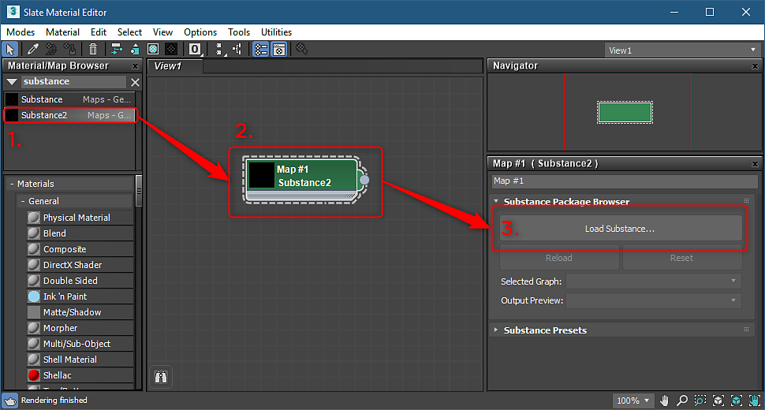
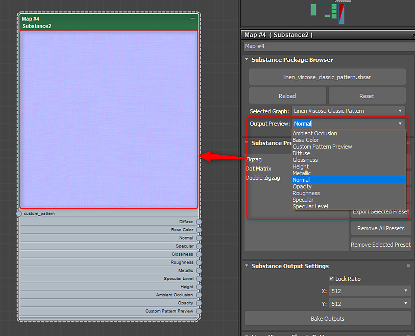

# Visão geral do Substance no 3ds Max

## Visão geral do plug-in:

## Abrindo um Substance

1. Abra o Editor Slate, procure por Substance e arraste o nó Substance2 para a visualização.
1. Clique duas vezes no nó Substance para ativar as propriedades e, em Substance Package Browser, carregue um Substance.

   >[!NOTE]
   >
   > Você também pode arrastar e soltar o arquivo .sbsar no Editor de ardósia para criar automaticamente o nó e importar a barra.
1. Se um Substance contiver vários gráficos, você poderá escolher o gráfico que deseja gerar como material no menu suspenso Gráfico selecionado.

   

   
1. Com o nó Substance selecionado, vá para o menu Substance e escolha um renderizador suportado. O material será criado e estará pronto para ser aplicado ao objeto. As texturas de Substance são conectadas ao material de renderização.

   | Renderizadores compatíveis |
   | --- |
   | Arnold |
   | Variar |
   | Corona |
   | Octano |

   

## Alterando a resolução:

1. Defina a resolução desejada para as texturas de Substance computadas nas Configurações de saída de Substance.
1. Para uma resolução de até 8K, verifique se você está usando o mecanismo de GPU, que está definido nas [Configurações de Substance](../../../3d-applications/3ds-max/settings-1/substance-settings.md).

   

## Alterando Parâmetros:

1. Clique duas vezes no nó Substance para carregar os parâmetros Substance na janela de parâmetros.
1. Altere os parâmetros para atualizar o Substance textura automaticamente.

   {width="500px"}

## Configurando visualização de saída:

É possível definir um canal específico para a miniatura do nó do Substance.

1. No menu suspenso Visualização da saída, escolha o canal que deseja usar para a miniatura do nó.

   

## Substance de divisão em blocos:

Você pode usar as propriedades Coordenadas para colocar texturas lado a lado e definir Canais de Mapa.

