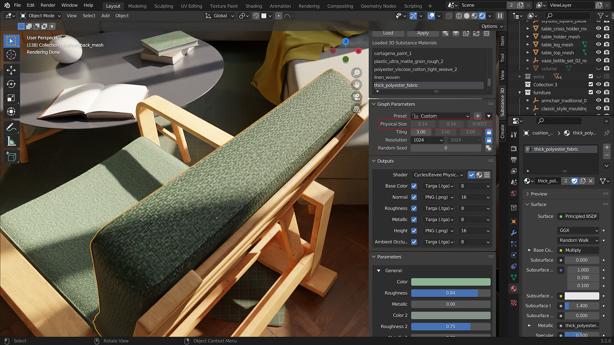

# Tamanho físico no Blender

O tamanho físico em materiais de Substance permite que os materiais sejam dimensionados com base em seu tamanho no mundo. As dimensões são definidas em aplicativos Substance como Designer e mostradas na seção Tamanho físico do painel de plug-ins.

Com o Tamanho físico ativado, os materiais serão revestidos com base em seu tamanho real em centímetros. A divisão em blocos gráficos do material permanecerá a mesma, independentemente da escala dos objetos. O recurso pode ser ativado alternando para o sombreador do Tamanho físico no painel do complemento. Depois de ajustar a escala de um objeto, a escala deve ser aplicada com ctrl/cmd+A para cobrir com precisão a Textura do Tamanho físico.

## Ajuste de Tamanho físico

Os valores no nó de mapeamento podem ser ajustados para controle artístico sobre a divisão em blocos gráficos de Tamanho físico. Além disso, um objeto como um Vazio pode ser usado para a entrada de Coordenadas de Textura para controlar o mapeamento de textura usando as transformações do objeto de entrada (veja o exemplo abaixo).

