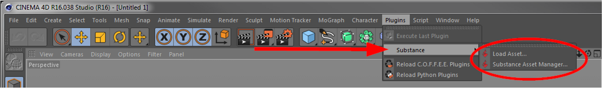

# Utilização do plug-in Substance

O plug-in Substance está localizado no menu Plug-ins do Cinema 4D.

{width="500px"}

## Carregar ativo...

Use isso para carregar ativos de Substance em sua cena. Somente arquivos de Substance (.sbsar) podem ser carregados. Se o Substance Asset Manager ainda não estiver exibido, ele será aberto automaticamente após a importação bem-sucedida do Substance. Esse comando também pode ser encontrado no Substance Asset Manager.

Após a importação, você pode ser perguntado se o Substance deve ser copiado para a pasta do projeto.

{width="500px"}

* Se você responder “Não”, um caminho absoluto para o Substance será armazenado na cena.
* Se você responder &#39;Sim&#39;, o Substance será copiado para a subpasta de texto do seu projeto e na sua cena ele será referenciado somente pelo nome do arquivo.

Esse prompt aparece somente uma vez por importação (por exemplo, ao arrastar e soltar vários Substance do Explorer ou do Finder).

## Substance Asset Manager

## Abre o Substance Asset Manager.

>[!NOTE]
>
> Assim como com todos os outros comandos no Cinema 4D, esses dois comandos podem ser integrados em qualquer lugar do layout e/ou configurados com um atalho de teclado para acesso rápido.
