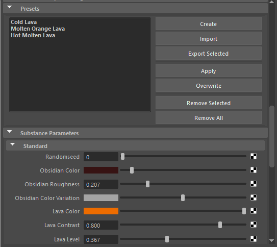

# Predefinições

Na seção Predefinições, você pode gerenciar completamente as predefinições incorporadas encontradas no arquivo Substance sbsar ou criar novas predefinições.

Para criar uma predefinição, faça as alterações necessárias nos Parâmetros do Substance e clique no botão Criar.

Para aplicar uma predefinição, selecione-a no menu e clique em Aplicar. Se precisar substituir uma predefinição, selecione-a no menu e clique no botão Substituir. Isso atualizará a predefinição com as novas configurações. Você também pode importar e exportar arquivos de predefinição de Substance (.sbsprs).
