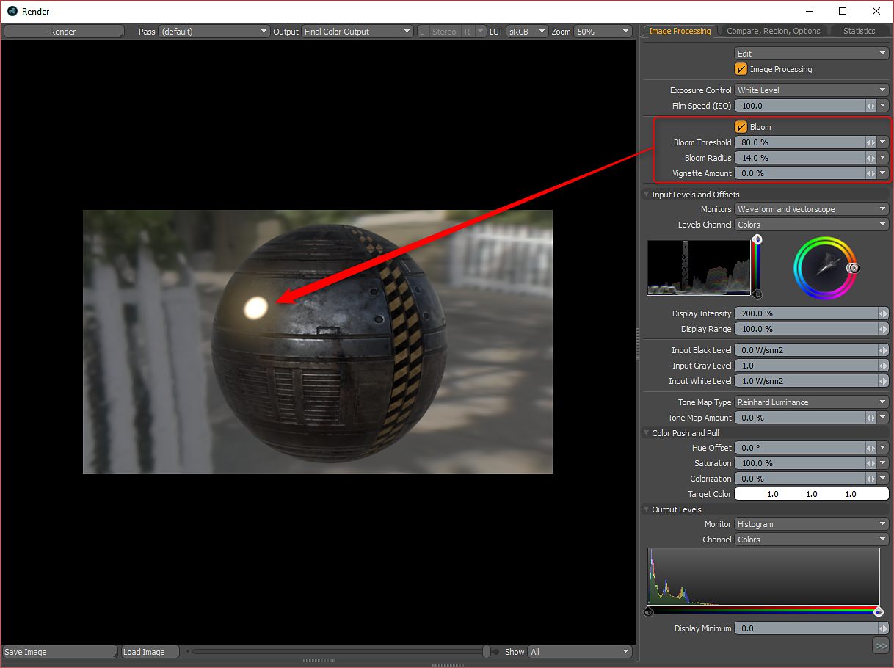

# Trabalhar com Emissivo

## Trabalhar com Emissivo (Quantidade e Cor Luminosa)

Substance pode ter uma saída emissiva opcional. Você pode usar isso como Quantidade luminosa e Cor no MODO. Quando você ativa a saída emissiva, ela será definida para o efeito Intensidade luminosa. Por padrão, esse canal é interpretado como Linear na guia Textura de imagem estática.\
Clique com o botão direito do mouse na textura na árvore Shader e escolha duplicar. Em seguida, defina a textura emissiva duplicada para o efeito Cor luminosa. Em seguida, é possível fazer alterações nos valores alto e baixo da textura que direcionam o efeito Quantidade de luminosidade para intensificar ainda mais o valor.

>[!NOTE]
>
> Para a textura definida como Cor luminosa, você precisa definir a interpretação como sRGB na guia Imagem estática.

Para obter um efeito de desabrochar, você precisa ativar Desabrochar no painel Renderizar e definir o Limite e Raio.

Para os materiais Unreal e Unity, a saída Emissiva é manipulada especificamente pelo material.\
Irreal = Irreal Emissivo\
Unidade = Emissão de Unidade

As texturas Emissiva irreal e Emissão de unidade precisam ser alteradas de Linear para sRGB na guia Imagem estática.
