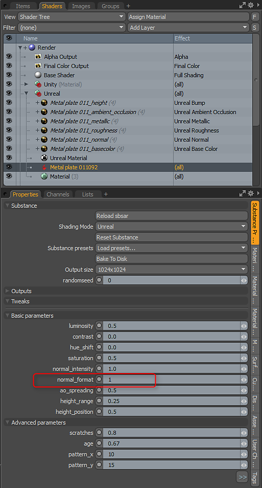
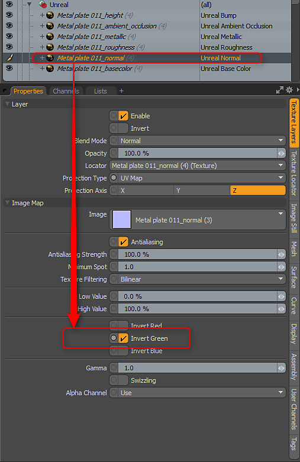

# Trabalhando com normais

Trabalhar com dados normais - Definir a orientação correta

Os Substance do Stock são criados para usar a orientação normal DX. No entanto, o MODO usa OGL. Você pode inverter o normal definindo o parâmetro Formato normal como 1.0. O plug-in Substance interpretará apenas os parâmetros definidos no Substance. Você pode encontrar um Substance que não tem o parâmetro “normal\_format”, pois cabe ao autor do Substance adicionar esse controle a Substance personalizados. Se encontrar um Substance sem esse parâmetro, você pode virar o canal verde na camada de Textura do mapa normal para corrigir a orientação.

>[!NOTE]
>
> Virar o canal de verde é apenas se o Substance tiver a orientação normal errada e o autor não tiver criado um controle para inverter o normal nos parâmetros de Substance

<table>
<tr style="border: 0;">
<td style="border: 0;" valign="top">

</td>
<td style="border: 0;" valign="top">

</td>
</tr>
</table>
