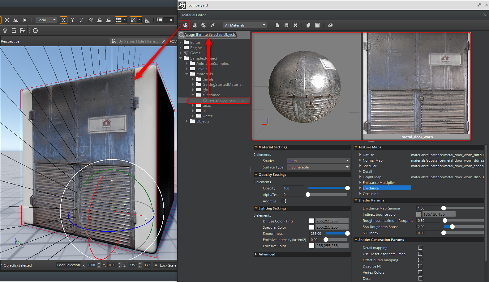

# Atribuir um Substance

Use o Editor de materiais para atribuir o material do material do mesmo modo que qualquer outro material no Lumberyard.

1. Clique no botão Editor de materiais para abrir o editor e navegar até o local na pasta de materiais onde você copiou o arquivo do substance.
1. Selecione o objeto e o material e clique no botão “Atribuir item aos objetos selecionados” na parte superior do Editor de material.

