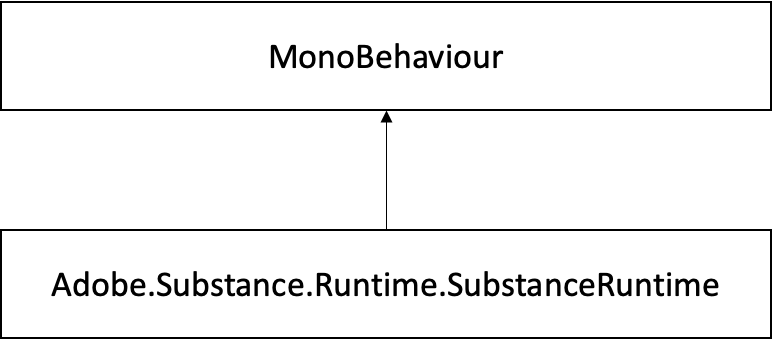

# Classe SubstanceRuntime

## Referência de classe Adobe.Substance.Runtime.SubstanceRuntime

Classe singleton que manipula a inicialização do mecanismo Substance e é usada para obter manipuladores nativos para instâncias do substance.\
Diagrama de herança para Adobe.Substance.Runtime.SubstanceRuntime:



### Funções de Membro Público

```
• SubstanceNativeGraph InitializeInstance (SubstanceGraphSO substanceInstance)
```


Cria um identificador do SDK do Substance para um determinado SubstanceGraphSO.

### Propriedades

```
• static SubstanceRuntime Instance [get]
```


Instância de singleton.

### Descrição detalhada

Classe singleton que manipula a inicialização do mecanismo Substance e é usada para obter manipuladores nativos para instâncias do substance.

### Documentação de Função do Membro

#### InitializeInstance()

```
SubstanceNativeGraph Adobe.Substance.Runtime.SubstanceRuntime.InitializeInstance  

( SubstanceGraphSO substanceInstance ) [inline]
```


Cria um identificador do SDK do Substance para um determinado SubstanceGraphSO.

**Parâmetros**

|  |  |
| --- | --- |
| substanceInstance | SubstanceGraphSO de destino |


**Retorna**

Identificador que se comunica com o Substance SDK

### Documentação de propriedade

#### Instância

```
SubstanceRuntime Adobe.Substance.Runtime.SubstanceRuntime.Instance [static], [get]
```


Instância de singleton.

Instância singleton global.

>[!NOTE]
>
> O NativeGraph.InRenderWork destina-se apenas a uso interno para comunicação com o Substance Engine e não deve ser usado para workflows personalizados.
