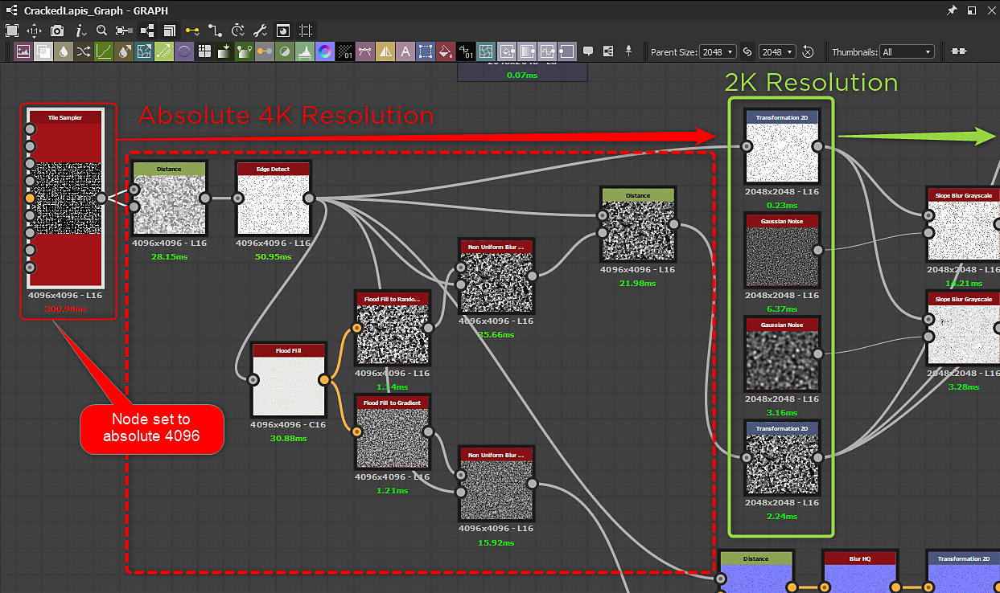

# Diretrizes de otimização

Quanto mais complexos forem seus materiais Substance, mais poder de processamento será necessário para renderizá-los. Os materiais do Substance devem, portanto, **encontrar um equilíbrio entre a complexidade e a velocidade de renderização**. Isso é *especialmente* importante se for usado em aplicativos gráficos em tempo real, como jogos.

Ao criar seus próprios materiais de Substance personalizados, verifique as diretrizes de otimização a seguir.

[Diretrizes de otimização de Substance Designer](https://docs.substance3d.com/display/SDDOC/Performance+Optimization+Guidelines)

Uma advertência importante a ser observada são os nós que têm uma resolução absoluta de 4K ou superior.

>[!WARNING]
>
> **Preste muita atenção à resolução e às configurações de resolução relativas ao pai!**\
> Valores altos afetarão seriamente o desempenho, portanto, considere como o material é susceptível de ser usado e se você pode reduzir os tamanhos dos dados envolvidos.
>   
> O mecanismo da CPU Substance pode computar em 4K, mas é muito lento e pode causar um travamento na integração ou possivelmente um travamento.

No exemplo a seguir, o tamanho de saída de um nó [Tile Sampler](https://experienceleague.adobe.com/en/docs/substance-3d-designer/using/substance-graphs/nodes-reference-for-substance-graphs/node-library/texture-generators/patterns/tile-sampler) está definido como [Absoluto](https://experienceleague.adobe.com/en/docs/substance-3d-designer/using/substance-graphs/output-size) 4096. Ele faz com que vários nós downstream sejam computados em 4K antes de serem reduzidos para a resolução de saída final de 2048.

{width="1000px"}
