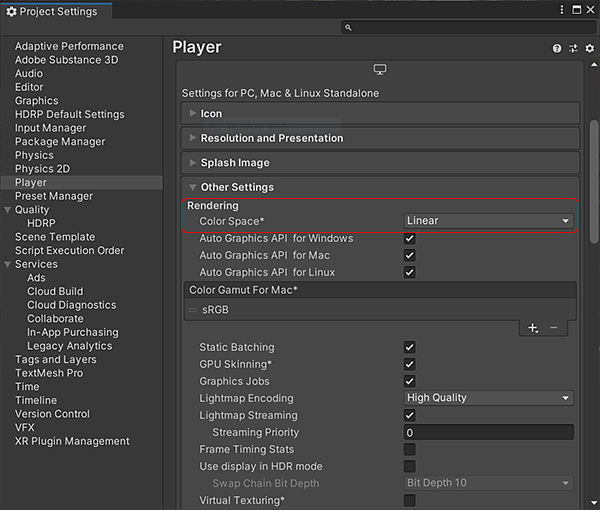

# Espaço de cor de renderização

As texturas Substance são projetadas para serem usadas com um sombreador baseado em Física. Para obter os melhores resultados, você deve definir o espaço da cor como linear nas Configurações do Unity Player.

1. Acesse Editar > Configurações do projeto > Player.
1. Na seção Renderização, altere o Espaço de cor para Linear. (O padrão da unidade é Espaço gama, que está incorreto e resultará na aparência incorreta da cor da textura).

   >[!NOTE]
   >
   > **Informações**
   > 
   > As opções de sRGB no textura são desativadas se a Configuração do espaço da cor no Unity for definida como Gama

   {width="600px"}
