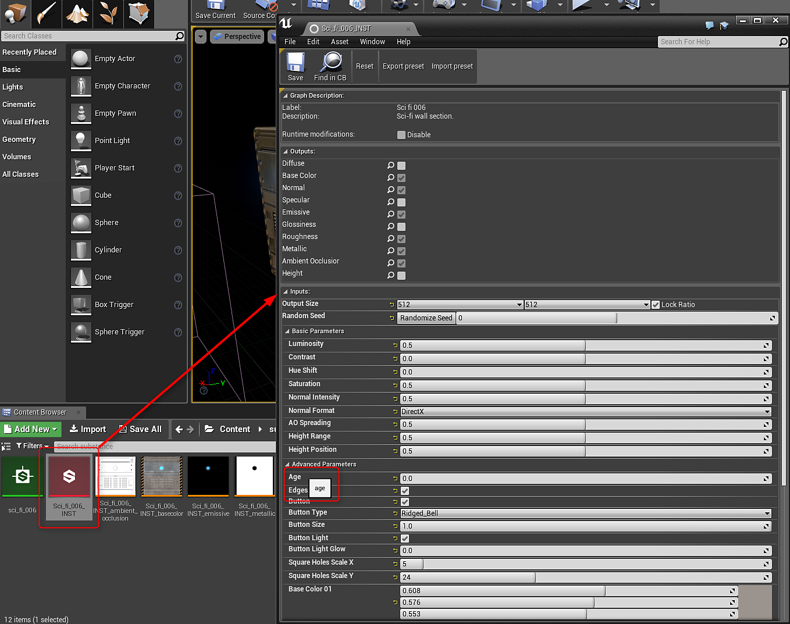

# Blueprint(UE4): parâmetros de material de Substance

## Alterando um parâmetro float:

Você usará o [nó Flutuante de Entrada Set](https://helpx.adobe.com/br/substance-3d/unlisted/documentation/integrations/blueprint-node-reference-151584784.html) para alterar os parâmetros de substância float, color(float4) e Boolean.

1. Crie uma variável com um tipo de “Instância de Gráfico do Substance” como referência.
1. Crie um nó flutuante Definir entrada e defina o destino como a variável Instância de Gráfico do Substance.
1. No nó Set Input Float, defina o Identificador como o nome do Parâmetro Substance a ser alterado.\
   *\* É possível localizar o nome do Identificador abrindo o INST do Substance e passando o mouse sobre o nome do parâmetro. O nome do Identificador aparecerá no pop-up da dica de ferramenta.*
1. No nó flutuante de entrada, arraste uma conexão para fora e crie um nó Criar matriz. O Make Array Node terá um índice de 0. O índice de 0 corresponde ao valor de flutuação.
1. Crie um nó de renderização Assíncrono ou Sincronizado e conecte a linha de execução do Flutuante de entrada Definir ao Nó de renderização. Defina as instâncias a serem renderizadas para a variável de instância de Gráfico do Substance.\
   *\* Assíncrono não está bloqueando e Sincronização está bloqueando.*

{width="800px"}

## Parâmetros boolianos

Os parâmetros booleanos são alterados usando Definir bool de entrada.

{width="800px"}

## Parâmetros de cor

Os parâmetros de cor são alterados usando Definir cor de entrada.

{width="800px"}

## Alterando um parâmetro de número inteiro:

Os parâmetros inteiros funcionam da mesma forma que a Precisão decimal Definir entrada. Você usará o nó Definir número inteiro de entrada.

## Identificadores

Você pode encontrar o identificador de um parâmetro no INST da substância. Mova o mouse sobre o parâmetro e a dica revelará o nome do identificador. Esse é o nome definido no campo identificador da saída em Substance Designer.

{width="800px"}
