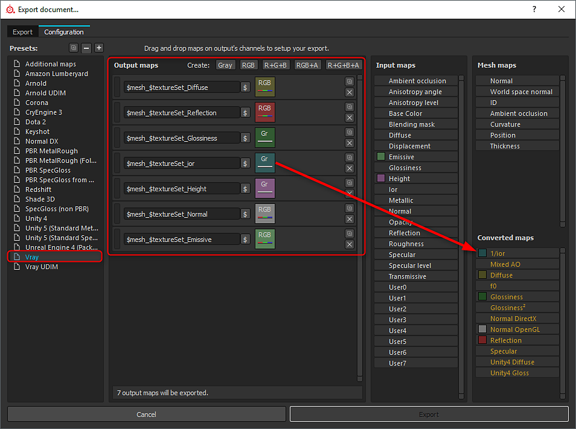

# Convertendo saídas de Substance

## Substance Painter

É possível exportar os mapas convertidos do Substance Painter. Uma ampla variedade de predefinições de renderização é compatível, e a simples seleção de uma predefinição converterá os tipos de mapas. (a conversão é baseada no fluxo de trabalho metal/bruto).

{width="800px"}

## Plug-in Substance

O plug-in Substance vai gerar saídas e criar materiais automaticamente para fluxos de trabalho específicos. No entanto, com aplicativos DCC e renderizadores de terceiros, pode ser necessário converter manualmente as saídas metálicas/brutas. As integrações a seguir oferecem suporte a fluxos de trabalho de renderização automática e converterão adequadamente qualquer tipo de mapa, se necessário:

* [Substance no Maya](../../3d-applications/maya/using-workflows/using-workflows.md)
* [Substance no 3ds Max](../../3d-applications/3ds-max/3ds-max.md)

## Substance personalizado

Se você estiver criando um Substance personalizado, poderá criar as saídas específicas necessárias para renderizadores como Vray e Corona. Usando o nó de conversão metálico/aspereza (Biblioteca > Utilitários PBR), você pode facilmente converter os mapas de cor de base, aspereza e metálico para o renderizador específico.

{width="600px"}
