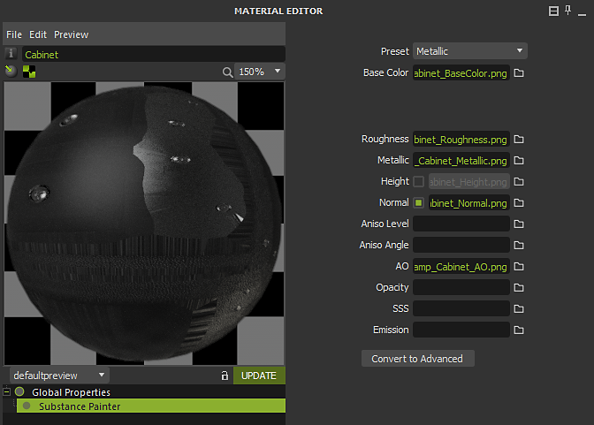

# Maxwell - Substance Painter

O Substance Painter 2020.1 (6.1.0) oferece suporte a Maxwell [Modelos de saída](https://experienceleague.adobe.com/pt-br/docs/substance-3d-painter/using/getting-started/export/export) para metálico/rugosidade e specular/brilho. Você pode simplesmente exportar usando o Modelo de saída Maxwell**.\
O Maxwell 5.1.0** tem uma integração com Substance Painter que permite importar texturas com facilidade e configurar automaticamente um material Maxwell.

## Exportação de texturas

Você pode escolher os Modelos de saída Maxwell (Aspereza metálica) ou Maxwell (Textura reluzente do Specular) para exportar texturas para renderização no Maxwell.

{width="500px"}

## Aplicar Texturas no Maxwell

Você pode usar a integração de Substance Painter no Maxwell para criar automaticamente um material com os mapas exportados do Substance Painter aplicado.\
Para começar, clique com o botão direito do mouse na Lista de materiais e escolha **Novo>Substance Painter**.

Navegue até o local em que você exportou as texturas de Substance Painter e selecione um dos mapas, como a cor base. Quando você clica em abrir, a integração cria um novo material Maxwell com os mapas atribuídos.\
Se você tiver vários conjuntos de texturas exportados do Substance Painter, a integração usará a convenção de nomenclatura para a textura para atribuir mapas de textura correspondentes.

{width="600px"}

Em seguida, atribua o material ao ativo na cena.

{width="500px"}

Todos os materiais aplicados usando a integração de Substance Painter.

{width="800px"}
