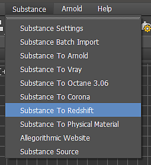

# Redshift para 3ds Max

## Substance no plug-in 3ds Max

O plug-in Substance é compatível com Redshift por meio da predefinição de renderização Redshift. O uso dessa predefinição configurará automaticamente as saídas de Substance conectadas a um material Redshift.

